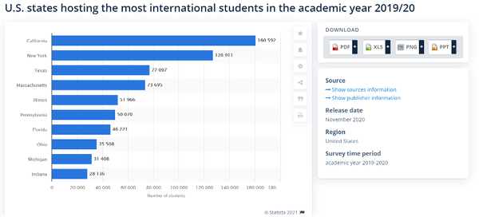
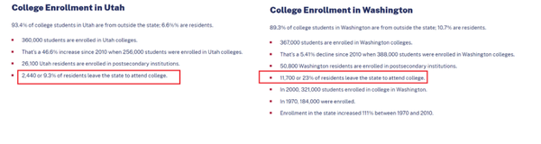

# 网上开户欺诈

> 给早期发行版读者的注意事项
> 使用早期发布的电子书，你可以获得最早形式的书籍——作者在写作时的原始和未经编辑的内容——因此你可以在这些书名正式发布之前很久就利用这些技术。
> 这将是最后一本书的第 13 章。
> 如果你对我们如何改进本书中的内容和/或示例有任何意见，或者如果你发现本章中缺少材料，请通过 ccollins@oreily.com 与编辑联系。

开始我们关于银行业和银行和金融机构面临的欺诈挑战的部分是有道理的，先看看在线开户欺诈。当然，部分原因是因为许多与银行相关的欺诈都需要一个帐户 - 有很多类型的欺诈没有帐户就无法尝试。但我们也从这个话题开始，因为它是许多银行在事情上线之前打击欺诈工作的基石，并且仍然是保护整个金融生态系统免受恶意行为者侵害的关键步骤。

## 虚假账户：背景

也许与在线开户欺诈相关的主要风险是钱骡开设账户，目的是作为欺诈计划的一部分转移资金。这当然是最令人难忘的风险之一——人们仍然在谈论当宙斯木马席卷银行业时，37 只钱骡协同行动，他们将超过 300 万美元的被盗资金转移回来。
金钱骡子曾经与年轻人联系在一起，但在 Covid-19 大流行期间，年龄范围显着扩大，现在从 18 岁到 50 岁左右的任何年龄段都普遍存在金钱骡子。银行领域的经验，指出对于第一次进入金钱交易的人不太可能产生负面影响 - 如果他们被抓住，他们总是可以声称自己无知。即使是第二次，也不太可能被起诉，即使金钱骡子是他们促成的非法资金转移的同谋。如果没有起诉，金钱骡子往往会卷土重来，从而扩大问题的规模。阅读本章时请牢记金钱骡子，因为它们是典型的用例。第 21 章更详细地介绍了钱骡，但现在我们只注意到它们通常是洗钱的一个因素，从欺诈企业中获取资金并以最终使其看起来合法获得的方式转移。
虚假账户存在其他问题，或为有问题的目的而设置的账户；它们可能是为信贷或贷款欺诈（第 19 章的更多内容）而设计的，包括使用多个账户的贷款堆叠，用于冠状病毒大流行中的刺激欺诈，成为合成身份攻击的一部分，等等。如果开设账户特别容易，客户可能会开设许多账户，以便从向账户存入 50 美分或 1 美元的企业收取小额款项，以检查账户是否合法——设置账户的消费者数以千计的帐户可以比你想象的更多。在某些情况下，更常见的是在电子商务中，欺诈者开立账户只是为了检查具有该电子邮件地址的账户是否已经存在。如果是这样，他们就知道这是帐户接管欺诈的一个很好的目标（ATO，在第 14 章中介绍）。
有时用于设置帐户的数据是伪造的或合成的，文件被盗或伪造以使其看起来合理。有时，真实客户的身份会被盗，他们的身份会被用来建立一个他们不知道的帐户。欺诈者甚至可能以假装帮助客户申请帐户等为借口，从客户自己那里获得了信息。当然，对于骡子，有时他们的真实身份被用来为他们作为欺诈帮凶的工作建立一个新的账户。欺诈者或戒指很可能有许多骡子以这种身份为他们工作。有时骡子知道他们在做什么，有时他们被欺诈者的似是而非的故事说服了，或者故意对正在发生的事情视而不见。欺诈预防团队需要能够发现所有这些可能的案例。

> 笔记
> 在我们开始研究防止设置欺诈帐户的方法之前，值得注意的是，合法客户设置多个帐户有很多充分的理由。客户可能拥有自己的帐户，也可能与配偶或合作伙伴、业务伙伴、孩子甚至家庭帐户共享一个帐户。他们可能有一个专门用于接收工资的账户，或者一个仅用于假期资金的账户。很容易对多个账户的风险感到过度兴奋，因为欺诈者确实经常尝试设置和使用多个账户。但重要的是不要将这种趋势与怀疑多个帐户本身混淆。

重要的是要记住有效预防开户欺诈的积极影响。阻止恶意行为者开设欺诈账户不仅可以保护相关银行免受洗钱问题（当然，该领域的合规性至关重要）或未来损失。它还保护金融生态系统的其余部分免受各种风险的影响，包括保护客户免受身份盗用，这可能导致受害者的信用评分被毁、声誉因保险欺诈而受损、资金因刺激欺诈而被盗等等。合成身份也有类似的危险，如果他们的大部分数据被使用，就会影响到真实的人（例如，想想社会安全号码可能造成的损害）。第 16 章有更多关于身份盗窃和合成身份的内容。
除了对个人造成的损害之外，如果恶意行为者能够建立银行账户，他们可以利用这些账户创建一个可以被挖掘的可信身份，那么保险公司、信用卡公司、抵押贷款协会等也会面临风险。信用、贷款等。这种不加控制的欺诈的连锁反应确实令人震惊，尤其是当你意识到它具有高度可重复性时。发现使用合成身份建立账户的可靠方法的欺诈者每天可以使用一系列不同的银行账户向不同的信贷和贷款公司申请数百个账户。此外，这种深度欺诈通常会在多年后成熟，直到欺诈者认为他们已经有效地最大限度地发挥了帐户的潜力并“破产”，以尽可能多的方式尽可能快地窃取，使一旦为时已晚，该帐户的欺诈性质就很明显了。
防止网上开户欺诈的核心是分析呈现的身份，首先判断是否是真实身份，其次判断当前使用的人是否就是该身份所属的人（如果是企业账户，则这同样适用于业务）。与上一节讨论的电子商务业务相比，银行在这方面具有优势，因为在入职过程中，银行在确认身份等方面会出现一些摩擦——这实际上是客户通常会感到放心的事情。由于银行作为机构的重要性——他们持有人们的资金和金融安全——客户对跳过显然旨在保护用户及其资金的圈子有更高的容忍度。这使得文件验证、年龄检查，甚至要求水电费或类似文件作为地址证明的过程可接受部分。网上银行的日益普及在这里也很有帮助。当大通银行对 18 至 65 岁的客户和非客户进行调查时，他们发现 80% 的人更喜欢以数字方式管理他们的财务，而不是面对面。客户有动力在合理范围内跳过摆在他们面前的障碍。
这种对摩擦的接受在新银行（也称为挑战者银行或仅在线银行）的情况下不太适用，它们面临着一个有趣的挑战，因为它们具有任何银行的所有监管责任，但具有一些敏捷性和流畅的体验 - 和期望 - 在线网站或应用程序。在这种情况下，最好的解决方案似乎是明智地错开摩擦；允许客户使用最少的信息来设置帐户，并且只需要根据 KYC 和良好意识的要求进行少量检查，但是随着客户变得更加投入并希望以更多样化的方式使用他们的银行帐户，会增加进一步的身份验证过程。新银行的一个优势——这可能至少在一定程度上抵消了避免摩擦的额外压力——是他们的用户往往更了解技术，因此诸如活跃度检查之类的方法可能会让老客户感到困惑，适合这些观众。

> 笔记
> 尽管这里的重点是银行和金融机构，但防止注册欺诈对电子商务网站和市场也很有价值，如果只是因为不这样做会使帐户在激活时看起来合法，也许几个月后，用于欺诈。还有虚假账户在生态系统中造成的混乱和对该生态系统的分析，以及与各种促销滥用的联系，如果不受阻碍，这可能会扩大成为一个严重的问题。

## 识别和缓解

有多种方法和工具可用于帮助保护机构免遭欺诈性帐户注册。哪些与你的组织最相关取决于多种因素，包括企业在开始时对低客户摩擦的重视程度、你服务的受众、你常见的欺诈类型等等。正如我们将在第 14 章中看到的，采用分层方法很重要。任何一种方法都不太可能为你解决问题——如果确实如此，欺诈者很快就会发现并解决它。分层防御是在门口阻止欺诈的最佳方法。
也就是说，所有组织都应采取措施识别机器人，欺诈者经常使用机器人来尝试非常快速地建立许多虚假账户，为未来的欺诈活动做好准备。我们在第 24 章中深入讨论了机器人，但重要的是要注意它们与帐户创建的上下文非常相关。如果没有采取措施来捕获机器人并阻止他们启动帐户创建，那么以后的损失可能会相当大。请记住，如果你的组织将流程分解为多个步骤，则机器人可用于自动执行帐户创建的任何步骤，因此仅分析流程的一部分将使你的组织容易受到攻击。欺诈者会测试你的流程，并会利用他们发现的任何弱点。
防止欺诈性开户只是欺诈预防团队负责的业务和客户旅程保护的一部分。开户应被视为客户和欺诈预防的重要里程碑，但也不应将其与未来的账户活动分开看待。安全和网络安全专业人员经常抱怨有人在建筑物内这一事实并不意味着他们有权在那里——人们倾向于认为一旦有人在那里，他们就必须被允许进入。各种犯罪分子都利用这一假设。
开户也是如此：即使你的组织在允许某人开户之前进行了严格的检查，让这变成假设每个拥有帐户的人都是合法的也是不明智的。也许有橙色标志，但不足以阻止开户，欺诈分析师决定权衡利弊，允许开户。采取措施定期分析帐户，以确保事情继续看起来合法。正如第 16 章所讨论的，这与合成身份特别相关，但对于其他类型的欺诈性开户也很重要。
在这种情况下，你可以制定政策来限制新帐户的代理权，从而降低它们对骡子的价值。例如，可能不到三个月的账户，缺乏一定的最低活动量，不应该能够接收或转移加密货币，或者能够获得超过一定最低金额的贷款或信贷，或者被允许接收超过一定数额的钱，等等。
甚至在此之前，通常预计会与开户一起发生的某些步骤如果缺失就会变得可疑。也许该帐户被允许继续，但因此发送给客户的信用卡或借记卡从未被激活。或者，该帐户可能已开立，但随后休眠了 6 个月。每家银行对于客户开始使用账户所需的时间都有自己的规范，防欺诈团队应该以该规范为基准，但一般来说，尽管客户转移可能需要时间——他们很可能会零星地转移薪水或账单——在最初的几个月内会有活动。如果没有，可能是时候再次查看开户信息了。
在开户时获得的信息对于确定消费者的行为是否继续符合该角色的某个人的预期（本章稍后将详细介绍客户角色）是很有价值的。如果没有，你的团队需要知道。不要将开户视为孤立的问题，因为它应该只是保护之旅的第一步。

### 提出问题，绘制故事
正如我们在书中其他地方所说的关于 IP 地址、电子邮件和其他数据点的内容，重要的是寻找开户细节背后的整个故事。这看起来合理吗？它是否与该客户的已知信息相符？
当然，进行自动检查以尽可能多地验证单个数据点很重要——电话号码、电子邮件地址、设备指纹识别物理地址等等，我们很快也会讨论文档验证。每个数据点都可能有一个相关的风险评分；电话风险评分将考虑 SIM 交换和移植的风险、与移动公司的电话记录的年龄等，而电子邮件风险评分将包括电子邮件的年龄，是否来自信誉良好的提供商，电子邮件的模式是否看起来合法或与之前欺诈案例中看到的模式相似，等等。 （关于电子邮件，请注意：Apple 等公司现在为消费者提供使用刻录机电子邮件地址的功能，以保护他们的隐私并避免垃圾邮件。客户可能不太可能将此类刻录机地址用于银行帐户，但无论如何这是一个需要考虑的因素。）能够识别合法客户很少提供给银行的一次性详细信息，并能够识别可疑速度（如果同一设备不断返回）也很重要具有不同的明显细节，这不是一个好兆头）。但总的来说，你需要知道的是：这里呈现的故事有意义吗？
为了分析这个故事是否有意义，提出问题很有价值——银行可以做到这一点，而不会让人感到打扰，而电子商务网站通常则不必这样做。诸如纳税身份、主要公民身份、婚姻状况、当前工作、当前收入、帐户的目的等详细信息提供了客户的丰富图片。如果某些细节似乎不匹配——例如，如果他们的主要住所在不同的州或国家，并且他们没有理由开设额外的账户，或者他们的收入大大超过你的预期期待他们声明的职业——然后系统可以将其标记为审查。
与往常一样，在审查期间牢记合法和欺诈的故事很重要。也许客户为一家在你所在的州或国家设有办事处的公司工作，他们正计划搬迁。也许当他们把“清洁公司”作为他们的职业时，他们的意思是他们经营一家大型清洁公司，而不是做清洁工。这种研究最好由人类分析师完成，而不是相信自动化过程，尽管同样，其中的一部分，特别是数据收集方面，可能是自动化的。使用尽可能多的数据源来证实证据，包括征信机构，将在审查之前和审查期间顺利进行，并且值得鼓励你的团队创造性地确定哪些数据源可能有价值。
例如，假设你需要解决如何联系主要公民身份和居住地不在美国的客户的问题，这些客户正在申请美国账户。也许你可以匹配反映从国外来美国学习的学生的数据库。尝试将图 11-1 中所示的人口普查数据集类型纳入你的方法中，以便更宽容地对待以下州的外国学生的申请。

图 11-1。 美国接收国际学生的州排名（来源：https://www.statista.com/statistics/237703/us-states-hosting-the-most-international-students/）
或者使用更细化的数据集，如图 11-2 中的数据集，来评估犹他州某人搬到夏威夷并在那里申请学生帐户的可能性与华盛顿某人做同样事情的（更高）可能性 .

图 11-2。大学招生对比（来源：https://educationdata.org/college-enrollment-statistics）
你的防欺诈团队可获得的数据越多，他们的决策就越准确。随着开放银行业务为客户和金融机构等带来各种新的可能性，重要的是要对可以使用哪些数据更轻松地打击欺诈和更顺畅的客户体验保持开放的态度。

### 文件验证

所有银行，即使是那些可以依赖愿意在身份验证过程中投入时间和精力的客户的银行，都试图使入职过程尽可能顺畅。你最有可能失去客户的时间是一开始，当他们不认识你并且离开时没有任何损失。一份报告发现，要求用户访问实体分行或通过邮件邮寄文件会导致客户前往竞争对手的流失率 23%。在过去的十年中，金融机构投入了大量资源来测试不同的方法，并得益于美国更标准化的身份证明文件流程的发展以及一些试图尽可能减少摩擦的优秀文件验证系统.可以通过电话完成的扫描，并使用人工智能来跟上欺诈者的伎俩，即使伪造品非常好，通常也可以捕获欺诈性文件。此外，如第 5 章所述，图像识别是机器学习的一个特别完善的用例。确保执行自拍检查的人与文档上的图像匹配是自然而然的。活性检查，确保所涉及的个人确实在那里，而不仅仅是图像或全息图，已经变得同样有效。不同的解决方案具有不同的优势和特点，因此每个欺诈团队仔细分析他们自己的需求是什么，什么最适合他们的要求是很重要的。
确定你的企业在何处使用文件验证有意义也很重要；年轻消费者往往对文件验证的摩擦特别敏感，因此如果你的机构与大量千禧一代和 Z 世代消费者合作，则可能值得将文件验证推迟到他们已经设置并可能开始使用之后帐户。
除了检查特定文件是否真实之外，检查它之前在你自己的帐户中是否没有出现过也很重要——以防止客户使用自己的身份证明设置多个帐户，也许使用他们的变体每次都起名字。同样，如果客户被拒绝了一次，那么抓住第二次使用相同标识的尝试也很重要。
欺诈者有时会创造性地通过附在 ID 上的自拍检查，使用帽子、围巾、眼镜、面具，甚至化妆，如果他们确实发现你使用的解决方案中存在漏洞，他们会再次利用它并再次。一些组织标记已知的“欺诈者面孔”，以便系统可以在他们回来时识别不良演员，无论他们的穿着如何或头发是什么颜色。
当然，所有文件验证解决方案都需要不断发展；已经可用的高度复杂的 deepfake 技术表明，这是一个不断发展的领域。与欺诈预防的大多数方面一样，这是欺诈势力与反对欺诈的欺诈斗士之间的持续军备竞赛。

### 客户角色
除了文件验证，即使在开户的早期阶段，客户角色的概念也可以发挥作用。从本质上讲，你正在分析客户是否看起来像他们看起来的那种客户，因为客户群体倾向于以相似的方式行事 - 老年客户的行为与千禧一代客户的行为不同，而有某些特征许多年轻的千禧一代专业人士将分享。如果你可以确定年轻的千禧一代专业人士群体的典型行为范围，那么你就可以标记出应该适合该群体的人何时表现不佳。
入职过程通常涉及用户共享一定数量的关于他们自己的信息，并与站点进行交互，即使只是有限的方式。当然，除此之外，还可以收集有关在线客户的常用数据，例如 IP 地址、用户代理信息等。还有许多基于行为生物识别技术的高效银行解决方案，它们也可以在这方面为团队提供帮助，并且会标记，例如，当有人复制和粘贴很少复制或粘贴的详细信息时，或者正在缓慢输入 SSN 时当大多数客户在一秒钟内完成时。 （更多关于行为生物识别的第 14 章讨论了 ATO，但你可以在本文中深入挖掘，我们喜欢这篇文章，因为它包含几个很好的说明性图像。）你拥有的所有信息应该形成一个连贯的图片客户。
欺诈团队应该清楚地了解不同角色通常的行为方式。例如，一位 80 岁的女性第一次开设在线账户，可能是在她一生都开过银行的同一家银行，与可能在不同账户拥有两三个账户的年轻专业人士相比，她的在线角色会有所不同。银行出于不同的原因，并且可能只是为了特定的利益而决定开设此帐户，例如已知具有良好忠诚度奖励的卡，或根据朋友的推荐。如果客户提供的有关他们自己的信息与他们的行为方式或他们使用的设备、浏览器、扩展程序、版本等不匹配，那么可以在流程中插入进一步的摩擦，作为额外费用的一部分认证过程。同样，对于银行，与电子商务不同，额外的摩擦并不理想，但从客户体验的角度来看也不是灾难性的。客户希望银行格外小心。客户支持代表打电话给客户进行额外检查，甚至可以在电话中发挥这种期望，强调他们有责任照顾客户。欺诈者很少喜欢在开户过程中进行互动，因此对任何类型互动的迹象感到害怕的客户，即使是电话等合理水平，也值得标记，以便重复尝试更容易识别。
人物角色是另一个重要的领域，记住开户只是预防欺诈过程的第一步。如果该帐户最初是基于一个 80 岁老人的角色而被允许的，但似乎用于购买健身房会员资格、蛋白质奶昔和能量棒——那么，你可能需要在那里做更多的挖掘。也许家庭成员正在利用。无论是开户行为还是购买行为都不一定是单独的问题，但综合起来，谨慎是明智的。

### 数据保留
银行和其他金融机构在数据保留方面处于一个有趣的位置，这是此类组织中的许多欺诈团队必须定期面对的问题，尤其是在考虑到他们使用的第三方解决方案的性质时想用。银行必须将有关其客户的大量敏感信息保留至少五年。当人们考虑到反洗钱责任、需要能够跟踪文件或资金踪迹以及金融信息对合法消费者的绝对重要性时，这是有道理的。出于这个原因，许多银行和金融机构倾向于谨慎行事，甚至比法律严格要求的还要多。
然而，在我们注重隐私的时代，这种保留也可能成为一种负担，特别是在受欧盟通用数据保护条例 (GDPR) 影响的国家，但在世界其他地方也越来越多。欺诈团队很可能希望保护自己免于保留可能感觉像是过多的信息，尤其是因为信息自由请求可以要求所有这些信息。在使用新的供应商解决方案之前，建议与公司的法律团队密切协商，以便在每种情况下建立最佳参数。此外，在数据请求的情况下，法律顾问将能够就哪些信息相关和不相关提供建议。幸运的是，许多供应商至少能够提供一些解决方案，在不保存任何信息的情况下发送验证答案，从而显着简化了此过程。例如，文档验证、自拍检查和活动扫描有很多内容——但很可能你想要保存的只是表示已获批准的回复。

## 概括

本章概述了人们开设有问题账户的动机，探讨了识别和预防这些账户的挑战，并讨论了欺诈团队在创建分层保护系统时可以使用的元素。这自然会导致讨论如何保护好账户（一旦建立）免受损害，这就是下一章的重点：账户接管。