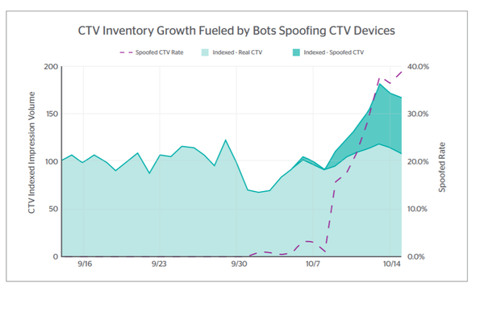

# 欺诈分析基础
> 给早期发行版读者的注意事项
> 使用早期发布的电子书，你可以获得最早形式的书籍——作者在写作时的原始和未经编辑的内容——因此你可以在这些书名正式发布之前很久就利用这些技术。
> 这将是最后一本书的第 3 章。
> 如果你对我们如何改进本书中的内容和/或示例有任何意见，或者如果你发现本章中缺少材料，请通过 ccollins@oreily.com 与编辑联系。

*“基本就是美”*
在本章中，我们将介绍欺诈分析的基础知识；与每个反欺诈团队相关的要素，无论行业如何。这些主题 - 其中最重要的是像欺诈者一样思考，但包括其他主题，例如欺诈预防中的帐户和交易之间的区别、实际异常检测以及危机规划和响应 - 在打击各种类型的欺诈时了解这一点很重要，以及在为你的组织制定更广泛的欺诈预防策略时也要牢记这一点。
在本书的其余部分，我们将无法在任何地方提及所有这些都相关的内容。它们几乎与书中的所有内容相关。它们是你在阅读时需要牢记的基础知识，是其他一切发生的背景。

## 像骗子一样思考

对于欺诈分析师而言，其中最基本的技能是像欺诈者一样思考。欺诈检测和分析的技术方面至关重要，但真正的成功需要正确的心态：欺诈者的心态。
欺诈者到处寻找漏洞，并在他们发现进入的地方进行攻击。你不能依赖他们迄今为止的行为；他们的整个 MO 都是基于试图欺骗你的业务。预测欺诈不像预测大多数趋势——因为欺诈者会反击。要在日常工作和制定高级策略时超越他们，你必须首先了解他们的想法。

## 专业的欺诈方法
至关重要的是，欺诈者专注于投资回报率。他们的目标是以尽可能少的努力获得尽可能多的收益（意思是尽可能多地偷窃）。这些不是戏剧性的国家赞助的坏演员，也不是电影中的黑帽黑客。这些是职业盗贼。他们更像是一个小型业务部门的负责人，他的目光总是放在他们的 KPI 上，而不是你在电影中看到的任何东西。
我们认为理所当然的欺诈者的许多事情背后都有这种特征。例如，如果一个目标加强了对他们的攻击，他们就会转向一个更容易的目标——否则他们会付出更大的努力，从而可能会降低回报。同样，他们经常攻击特别受欢迎的商品——因为他们更难在大量合法感兴趣的买家中被发现，而且这些商品本身很容易以高价转售。
了解这些趋势背后的心态很重要，因为这样你就可以充分了解用于欺诈的技术和工具的演变。几年前，欺诈者最有可能试图在网站上获得价格最高的商品。当制定规则来防范这种趋势时，他们转向订购倍数、组合或许多单独的廉价商品订单。当欺诈保护系统开始标记自动表单填写时，欺诈者开始在“打字”中添加随机中断，以使自动化看起来更人性化。对他们来说，一切都是为了在最简单、最快的方法和最大的回报之间找到最佳平衡。
同样，内化这种心态将使你能够在职业生涯中的行业之间移动，并应用迄今为止学到的所有东西，即使它们在不同行业有不同的表达方式。攻击服装网站的欺诈者通常会假装需要团体、俱乐部等的批量订单——在这种情况下，这是一个非常正常的用例。电子网站上的同一欺诈者会巧妙地将笔记本电脑与键盘、鼠标和耳机配对 - 因为他们知道在这种情况下看起来很正常。你会知道这都是一样的举动。同理，同一个骗子会尝试对银行进行APP诈骗，对在线礼品卡商店进行受害者辅助诈骗。

### 谨慎对待类别

同样重要的是要记住，虽然为了方便和清晰起见，我们将把欺诈攻击、混淆技术等分为几类，但欺诈者并不这么认为。例如，欺诈者往往专攻某个特定行业；这再次归结为投资回报率。专业化最大限度地提高了他们所做的研究的价值，即哪些产品最容易被盗，如何最好地利用盗窃的结果等。
然而，欺诈者并不限制自己；一份报告发现 86% 的欺诈者在一个以上的行业实施欺诈。1 他们需要另一条绳索，因为当他们的专业化行业经历缓慢的时期，或者他们已经变得太热以至于无法控制他们一会儿。
这再次归结为投资回报率；花时间完善特定攻击的欺诈者可能会发现他们尝试攻击的电子商务网站都学会了如何阻止它。但银行网站可能并非如此。所以他们会在那里尝试，在他们不得不投资修改它之前充分利用该技术。
欺诈攻击类型也是如此。我们会区分帐户接管 (ATO) 和交易欺诈，你的部门可能也会这样做 - 但欺诈者不会。同一份报告发现，92% 的帐户接管欺诈者还实施了另一种欺诈。2 对于欺诈者来说，重要的是结果，而不是他们如何到达那里。接管帐户是欺骗网站让你使用其他人的详细信息进行购买的一种方法。窃取和使用忠诚度积分以及使用窃取的信用卡信息可能看起来非常不同 - 但对于欺诈者来说，它们非常相似：他们正在使用不属于他们的东西来窃取他们可以获利的东西。
棘手的是，对于欺诈团队而言，你捕获 ATO、发现被盗信用卡欺诈和保护忠诚度积分的方式是不同的。在某些组织中，它们归不同的团队所有。但是，如果你不牢记，对于欺诈者而言，这些都是同一游戏中的不同动作，你的欺诈预防策略将无法对抗敌人的心态。

## 账户与交易
欺诈检测圈中经常采用的一种划分是分析和决策帐户与分析和决策交易之间的划分。这是一个实际的区别，因为它从消费者的角度反映了两种截然不同的在线交互类型之间的差异。交易可以作为访客在网站上进行，无需帐户，主要是关于付款。另一方面，有很多事情可以用帐户完成（添加详细信息、重置密码、使用忠诚度积分、存储优惠券等），而这些事情与进行交易没有直接关系。
欺诈者通过攻击账户和攻击交易点所造成的伤害也是不同的。交易主要是财务风险；弄错了，你会得到退款。账户责任与客户的信任度、他们对你品牌的忠诚度以及你的生态系统的整体可信度有关（因为你拥有的虚假账户或 ATO 账户越多，你的生态系统变得越弱和不可信）。这反映了你在每种情况下提出的问题的根本区别。对于帐户，你会问：身份背后的人是它所属的人吗？对于交易，你实际上是在问：这笔付款是否合法？
由于所有这些原因，在许多大公司中，不同的团队负责帐户保护和交易保护。然而，越来越多的趋势是将这些团队置于同一领导或高管之下，作为更广泛的信任和安全团队或风险管理团队的一部分工作。这鼓励的相互学习和合作的增加非常有价值，因为账户和交易方面的工作可以互惠互利，我们建议确保类似的协作水平，即使你的内部结构意味着团队不合作.
账户保护应以交易知识和决策为依据；如果 ATO 非常巧妙，以至于它在结帐之前一直漏掉，那么在结帐时提供更多信息时，你需要立即采取行动保护帐户，并拒绝交易。另一方面，如果你从他们的帐户中获得对用户及其身份的深入了解，那么你的交易保护将更加有效。
正如我们所说，对于欺诈者来说，这些方法并没有什么不同。同一个欺诈者很乐意在同一个网站上进行 ATO 和以结账为重点的欺诈，有时甚至在同一天。这仅取决于他们拥有的详细信息以及他们发现的利用漏洞的不同方式。因此，如果 ATO 团队识别出欺诈环或重复欺诈者，交易团队也需要知道要查找什么才能抓住他们。孤岛工作很危险，因为欺诈者花费大量时间分析你的欺诈预防工作。一旦他们确定了一个孤岛，他们就会利用它。

> 笔记
> 一般而言，我们在本书中讨论的分析技术与账户保护和交易保护都相关，尽管有时我们可能会强调其中一个，这取决于哪个是更占主导地位的用例。

## 在阻止欺诈和避免摩擦之间：平衡
这种微妙而持续的平衡行为反映在欺诈团队角色的每个部分以及本书的每个部分中。我们不会在每个部分都提到它，因为这会变得相当重复，但我们怎么强调记住它是多么重要。
金融科技战略家和连续创业者 Maya Har-Noy 说得很清楚：“在线业务的运作方式，接受一些欺诈风险是不可避免的。如果你想要零欺诈，请不要在线销售。你会完全安全，但你的生意会死。如果你想出售，你必须接受你会有一些欺诈行为。”
十年前，欺诈预防团队的衡量标准是退款——他们的工作只是阻止欺诈。总的来说，企业并没有完全意识到欺诈部门对客户体验以及相关成功和增长的影响。
现在，情况不再如此。商户风险委员会的首席执行官 Julie Fergeson 解释了这种演变：“当在线欺诈成为有组织的时候，它最初就像洪水一样 - 商户经常处理的退款规模在今天是无法想象的，从而压低了可能达到的退款率。高达 3%。商家欺诈团队和供应商共同努力控制局势，一旦达到更稳定的点，退款达到我们今天所知道的那种规模，欺诈斗士可以喘口气，开始关注摩擦和误报.这就是今天的大量工作和重点所在。”
这意味着欺诈部门面临着既要防止欺诈又要保持低退款率，还要尽量减少他们的工作对优质客户的影响的压力。这通常意味着需要集中注意力的两个关键领域：避免明显的摩擦，例如电子邮件验证或 2FA，以及避免错误拒绝，即合法客户被错误地拒绝或阻止。
最终，这两个挑战的答案是相同的：准确性。你的系统越准确，就越能准确地避免激怒好客户。从这个意义上说，这个问题的解决方法和抓骗子的方法是一样的；你想非常擅长区分好用户和坏用户。

### 利润率

在适当地平衡欺诈成本时，你需要考虑利润率。愿意接受更高的欺诈成本是很好的，这样你就可以优先考虑客户体验，但你实际上能负担得起什么？实际上，在保持盈利的同时，你可以承受多少欺诈交易？
要理解这一点，你需要知道每笔欺诈交易你损失了多少。这取决于你的业务性质。如果你损失了商品的全部成本加上运费、退款处理和任何相关罚款，那么每次欺诈交易的成本都很高。例如，如果你从事游戏或软件行业，那么你的成本可能最低。除非你是经销商，否则这取决于你的许可协议……等等。所有这一切都必须与你的利润率进行权衡，这同样因企业而异。与防欺诈的许多领域一样，你需要从内到外了解你的业务，以做出正确的决定。
一个简单的例子来说明这一点：假设你在一次欺诈交易中平均损失 100 美元。但是，对于每笔欺诈交易，你会看到 100 笔其他交易，每笔价值 100 美元。假设你有 1% 的利润率，即使在这种情况下，你也能胜出。所以你知道你可以承受多少传入的欺诈风险。本质上，这是一个投资回报率计算。

### 保持动态张力
由于完美的准确性更像是一个圣杯，而不是一个现实的目标，因此明确你也可以使用的其他策略很重要。在适当的情况下，应该动态地使用摩擦力，并明智地应用摩擦力。使用积极验证的形式可以避免错误拒绝，以识别优质客户。如果没有成功，请采取措施分析客户在拒绝后第二次或第三次尝试的情况；是欺诈者试图欺骗你的客户服务部门，还是被误解的合法客户？对账户活动和交易的持续研究，与你当前需要的决策分析分开，也有助于识别误报和避免误报的方法。
撇开策略不谈，关键是在你的欺诈团队做出的每一个决定中——无论是关于是否批准特定交易，或者投资哪些工具，或者添加哪些规则来应对新情况，或者如何培训或重新训练机器学习系统——将包括在阻止欺诈的需要和为优秀客户提供良好体验的需要之间取得平衡。
这种动态的紧张是使欺诈预防如此具有挑战性和吸引力的核心。也是一个机会。 Julie Fergeson 在与各行各业的商家合作以及帮助来自不同组织的欺诈斗士合作以实现互惠互利方面拥有多年经验，这意味着她已经清楚地了解欺诈和支付专业人士在其公司中的看法的演变。
朱莉说：“支付和欺诈预防专业人士现在在高管席上占有一席之地。有一种真正的理解——甚至五年前都不存在——这些元素对于创造积极的客户体验以及公司的整个财务框架至关重要。电子商务和在线支付和交互不再是显示相关性的复选框。它们对现代企业至关重要。”
欺诈预防专业人员通常需要就其工作的复杂性对组织的其他部分进行教育，但结果是更好的部门间协作以及更好的销售和欺诈预防结果。

### 心理成本
在欺诈和摩擦之间找到适当的平衡可能是欺诈预防中最复杂、最有趣和最吸引人的方面之一。然而，因为每一个决定都伴随着如此明显的财务成本，如果它是错误的决定，欺诈团队——尤其是在第一线决定是否批准或拒绝交易的人工审核人员——有时会感到紧张.
Newegg 欺诈总监 Julia Zuno 指出：“作为一名经理，我的首要任务之一是找到减轻欺诈团队成员负担的方法。当事情变得有压力时，就像他们在销售或假期等特别繁忙的时期所做的那样，他们会变得非常有压力——很快。这意味着加班、担心和太多的能量饮料。管理者可以采取一些措施来缓解这一切。帮助你的团队保持他们的观点很重要，确保他们知道你支持他们同样重要。你需要制定正确的政策，并在你有空闲时间深入研究战略时进行明智的考虑。你需要不断就所涉及的问题对高层管理人员进行教育。你需要为你的欺诈斗士提供他们做好工作所需的所有工具。”
Julia 建议的许多缓解策略代表了需要全年进行的投资。但是，在压力特别大的时期，欺诈经理需要对这种高压工作的心理影响特别敏感。正如朱莉娅所说，“此刻，有时，你需要成为一名顾问和一名经理。这是工作的一部分。”

### 信任等级

当谈到摩擦时，标记动态摩擦的概念很重要。并非所有级别的信任都是平等的，因此你的摩擦选项也不应如此。
Zoom 信任和安全首席产品经理 Aamir Ali 曾在 YouTube 工作，他指出：“这确实是一个信任等级的问题。你可能会认为交易是二元的 - 批准或拒绝。但风险是一个范围，摩擦可以反映这一点。想象一个新用户正在注册一个帐户。如果你对这个客户非常有信心，根据你拥有的信号和信息，你可以确保他们立即获得良好的体验，并让他们访问你平台上的每项服务和选项。如果你有点怀疑，你可以给他们限制访问，并稍微监视他们，然后再决定。如果你更怀疑，或者只是需要更多信息，你可以添加明智的摩擦。有一个完整的范围，从验证码到电子邮件验证到短信验证，再到给他们打电话，再到将小额存款存入账户。金融机构甚至可以要求提供文件。你需要将摩擦步骤与用户所属的信任层相匹配。”

> 在防止欺诈和摩擦之间取得平衡的背景下，提及 3D Secure (3DS) 是有道理的，消费者通常通过卡网络以 Visa 验证和万事达卡的 Securecode 等形式对其应用最为了解。
> 3DS 固有地涉及摩擦，中断购买以要求客户通过提供密码、动态代码或生物识别身份验证之类的东西来证明他们是他们所说的人。
> 出于这个原因，它的第一个版本 3DS1 需要相当复杂的密码，除了在英国之外仍然不受欢迎，大多数非英国商家因为购买时的高退出率而避开该选项；客户（在英国以外，出于某种原因）根本不愿意采取额外的措施。
> 随着 3DS2 的出现，3DS 变得更加相关，其中包括生物特征身份验证选项和消费者近年来已经习惯的那种双因素身份验证。欧盟的 PSD2 法规也提请注意 3DS 作为选项，因为它是满足强客户身份验证要求的最明显方式。然而，商家的采用一直坎坷，再次提出并辩论了平衡摩擦与欺诈预防的问题。
> 商户风险委员会一直积极参与与相关方的谈判，以确保有关当局了解对商户的真正影响，而商户欺诈预防团队反过来也了解他们所涉及的情况。在未来很长一段时间内，寻找一种既能提供强大的客户身份验证又不会对商家和欺诈团队施加过度压力的流程的过程很可能会以政府的步伐继续进行。你可以在 MRC Advocacy 页面上关注此问题的更新。

## 异常检测

一般来说，人们可以争辩说，大多数分析师和数据科学家的主要工作是检测异常数据趋势。尽管存在一些独特的挑战，但欺诈分析领域也无法摆脱这一现实。我们将陈述显而易见的事情，并说每个风险/欺诈团队都应警惕地监控其产品的流量趋势，以便尽快发现异常并做出反应。
网上有充足的资源可用于可视化和监控系统中的流量趋势，这很自然（而且很棒）。你可能会使用 BI 仪表板或定制开源 Python 脚本来绘制数据。

> 提示
> Pandas 和 Matplotlib.pyplot 计数图可能会有所帮助；参见例如使用 Matplotlib 在 Python 中自定义时间序列图上的日期。

在一个完美的世界中，流量异常（例如，电子商务零售商收到的订单激增）将很快被识别和分析，以确定它们是欺诈攻击的结果还是销售增长的结果。可悲的是，我们不完美的世界通常不会让我们对易于解释的异常现象感到安慰。有两个主要因素使流量异常难以与欺诈攻击联系起来：
大多数欺诈攻击只是由于受害者投诉（退款、客户纠纷等）而被发现或至少得到确认。受害者的投诉需要时间，通常在事件发生后数周或数月到来。美国运通卡持有人甚至可以在涉嫌欺诈性收费数年后提出欺诈性拒付。这意味着异常检测永远无法真正为我们提供欺诈攻击的全貌。充其量，它只会突出我们应该开始深入调查欺诈调查的流量子集。
尽管欺诈攻击在财务上可能非常严重（特别是对于最终为被盗商品支付费用的电子商务零售商），但它们在总流量中的份额很少达到两位数。经常听到高风险垂直行业的电子商务零售商讨论大约 2% 的传入欺诈率（例如电子商务欺诈真正使你的业务付出什么代价？）。欺诈率不高是好事，否则电子商务将无法生存。然而，这一现实使欺诈数据集不平衡——即通常不会有足够的欺诈案例来“移动针”并告诉你欺诈环正在出现，直到为时已晚。
刚刚提到的两个因素的一个例外可以在 AdTech 欺诈分析这个精致的领域中找到。 AdTech 欺诈几乎是用于基于异常检测的分析的大数据绿洲，因为该领域的攻击往往会非常迅速地发展到巨大规模。例如，如图 3-1 所示，该领域的攻击企图甚至达到流量的 40% 并非闻所未闻（请参阅伪造设备：针对 CTV 的新欺诈计划）。



图 3-1 中描述的流量异常是使用计数图进行欺诈检测的一个明显示例。对于 CTV 的流量激增（联网电视印象，即在智能电视、流媒体设备等上观看了多少广告），没有合理的解释。事实上，一旦欺诈研究人员深入研究流量，他们就能够将 10/13-10/14 测量的 40% 的流量归类为欺诈。
回顾一下异常检测作为欺诈分析方法的话题——这个据称强大的工具应该只用作触发深入调查的“预告片”。如果你从事电子商务或银行业务，那么对异常情况持保留态度是值得的，因为你意识到数据需要老化才能收到受害者投诉，此外还要记住欺诈率通常太低而难以察觉。话虽如此，异常情况可以指出欺诈趋势正在出现的地方，或者至少可以帮助你衡量欺诈发生后的影响。

## 实际异常检测：密度案例研究

考虑异常的更细粒度的形式不是寻找高级趋势，而是发现来自特定用户的异常行为。以下案例研究假设对于某家银行，“普通”用户每天最多登录一次。该查询旨在发现表现出异常登录指标的用户。首先，查询生成以下每日登录直方图：

| UserID | LoginDate   | Count_Logins |
| ------ | ----------- | ------------ |
| 1111   | January 1st | 1            |
| 1111   | January 2nd | 2            |
| 2222   | January 1st | 1            |
| 2222   | January 2nd | 30           |
| 2222   | January 3rd | 1            |

使用 daily_logins_per_user_count 为：

```sql
(select
 userID
 ,LoginDate
 ,count(*) as count_logins 
 from user_logins
 group by 1,2)
select
userID,
       sum(case when count_logins = 1 then 1 else 0 end)/count(*) as perc_of_1_logins_in_perc,
       sum(case when count_logins >1 then 1 else 0 end)/count(*) as perc_of_above_1_logins_in_perc,
       sum(case when count_logins >1 then imps else 0 end)/sum(count_logins) as perc_of_above_1_logins_from_logins_in_perc,
       sum(count_logins)/count(*) as avg_login_density,
       sum(count_logins) total_login
from daily_logins_per_user_count 
group by 1;
```

在生成登录直方图表后，我们测量以下指标以测量用户登录的密度/速度水平：

1. 该用户活跃天数中“正常”交易量天数的比率
2. 该用户活跃天数占异常交易量天数的比率
3. 登录总数中异常交易量天数的比率，允许关注持续显示异常数据的用户与仅在短时间内飙升的用户
4. 平均登录率 - 从所有活跃天数中简单划分登录

很容易将 IP/cookie/设备聚合添加到这个标准查询中，以便衡量异常的不同方面并从这个基本实践中获得进一步的分析见解。如果我们希望寻找与欺诈相关的异常以及高度参与的用户的可能合法场景，那么使用被认为是正常的阈值也是简单而有效的。

## 危机：计划和响应

我们在 2021 年冠状病毒大流行期间写了这本书，因此如何为危机做准备以及在危机期间做什么是每个人都关心的问题。当然，危机的部分性质是它们往往要求你“预料到意外”——如果你知道它即将到来，你就会做好充分的准备，你的团队可能不会危机模式。
但是，你可以从大流行中吸取某些教训，以帮助你的团队和企业为未来的危机做好准备。这项练习虽然在正常的日常职责之外，但非常值得每年至少进行一次，因为无论危机与危机之间的其他情况可能有所不同，你可以确定一件事：它会给你带来新的压力欺诈预防小组。
80% 的注册欺诈审查员表示，在经济困难时期欺诈水平会上升，许多欺诈分析师在冠状病毒大流行期间亲眼目睹了这一趋势。与此同时，Ponemon Institute 发现，在大流行期间，组织保护自己免受欺诈的能力下降。在 Covid-19 之前，45% 的受访者认为他们的欺诈预防有效性很高或非常高，而仅仅一年多之后，只有 34% 的受访者这样评价自己。3 危机规划将帮助你的欺诈团队掌握一切当它发生时，把它（并向管理层解释它的真正需求）看作类似于渗透测试或业务连续性计划。如果最坏的情况发生，对业务的影响可能同样巨大。

### 经济压力影响消费者的处境和决策
无论你面临何种危机，都可能会给你的部分或大部分用户带来新的财务压力。这不可避免地会影响欺诈预防专业人员的工作环境。
当更多人失业时，这会扩大欺诈者可以利用的潜在骡子池。害怕继续失业的人不太可能仔细研究他们工作的细则，而且更有可能对任何应该让他们感到不安的事情闭上眼睛，因为他们被用作犯罪企业的一部分。在 Covid 19 危机期间，这一点值得注意：犯罪组织开始扩大他们的阴谋活动，扩展到新的领域甚至国家。它甚至不限于放弃 shuserping。随着欺诈者挖掘他们的本地知识，骡子成为外包社会工程元素的一种方式。这意味着可以轻松地针对地理、文化和语言进行剪裁。即使以前在线欺诈水平较低的国家也受到影响，现在几乎到处都可以找到骡子。
当然，有些人通过建立合法企业来应对这种情况，有时涉及批量订购物品，然后他们将与其他物品重新包装并作为包装出售 - 生存包，卫生包，工艺品活动，护理包等。尽管此活动与骡子操作相似，但欺诈团队需要避免禁止此活动。
此外，网络钓鱼尝试急剧增加。消费者比以往任何时候都更在线，尝试新网站，并且匆忙和压力，使他们比平时更容易成为各种网络钓鱼计划的目标。对于欺诈预防而言，关键后果是欺诈者新获得的大量被盗信息，尤其是 ATO 企图。不出所料，ATO 做出了回应。
每项挑战都需要自行调整。所有这些都发生在一起，欺诈预防团队面临着来自各方的风险。正如 Alon Shemesh 评论的那样，“在这种情况下，就像一场完美的风暴。还有社会工程方面——欺骗人们提供他们的数据要容易得多。最重要的是，还有技术方面的问题——家庭基础设施的安全性较低，但这正是人们所使用的。然后你需要考虑欺诈预防团队的工作经验，他们通常习惯于密切合作，标记变化并相互检查以验证身份、详细信息或趋势。突然之间，实践协作变得更加困难。”4

> 长期规划
> 这是提及危机中所需的长期规划的好地方。在冠状病毒的情况下，ATO 确实跃升了——但与网络钓鱼的程度不同。这是一个线索，表明有远见的欺诈者正在存储详细信息以更慢地使用，有时欺诈团队会不那么可疑，而在一年中特别繁忙的时候，ATO 更有可能被忽视。
> 在危机中，你的大部分资源将用于跟踪当前时刻和应对眼前的挑战。但同样重要的是跟踪可能意味着未来出现问题的趋势 - 并采取措施至少在以后解决这些问题，即使你不能立即这样做。
> 同样，如果你正在努力适应新的工作环境——例如分析师大多在家工作——寻找短期解决方案很重要，但要分析真正给团队带来压力的因素以及长期变化的因素需要适应对于长期成功至关重要。

### 为用户行为的转变做好准备
所有欺诈预防团队都依赖于分析用户在其网站上的典型行为，而严重依赖机器学习的团队则更是如此。如果你不知道正常情况应该是什么样子，你如何识别一个像小偷一样行事的欺诈者？
在危机期间，用户行为会发生巨大而迅速的变化。当然，在冠状病毒大流行期间，突然转向在家工作，这意味着新用户和地址正在发挥作用。一天中的不同时间成为最受欢迎的购物时间，因为家里有孩子的父母不得不根据自己的日程安排工作。由于人们大部分时间都在家，因此需要新的交货时间。在线订购并从方便的取货地点取货突然风靡一时。青少年们拿着父母的卡片购物。
这些特定的变化是针对具体情况的，但在任何其他危机中可能会发生类似的变化。当今热门产品的转变几乎是肯定的 - 欺诈者将在这种情况下处于领先地位。这是他们的事；他们会像任何仓库物流经理一样热情地观看。
根据你的业务性质和危机，你可能会遇到大量订单或突然干旱。在任何一种情况下，都会产生欺诈预防的后果。 Uri Arad 指出，在这种情况下，你需要改变对拒绝率、退款率、攻击率和误报率的关注。如果你的企业遇到的流量比平时少，但欺诈者却像往常一样频繁地四处游荡，那么下降率的飙升意味着你的经营状况良好。
如果你有很多新帐户正在设置，或者休眠帐户开始活跃，那是积极的 - 但在合法活动中混合的欺诈尝试可能比你通常预期的要高。在分析工作时考虑到这一点，并确保相应地调整 KPI 以反映你和你的企业所处的新位置。
你需要为不依赖于典型模式的分析做好准备，因为正如 Arad 所说，“在这种情况下，一切看起来都异常。”想想你可以分析的不受此次危机影响的工具和其他趋势。如果你的机器学习模型遇到困难，请准备好对新数据进行重新训练，并制定适当的流程来度过流沙的时期。
无论是什么打击了你的特定业务，你很可能会看到比平时更多的新用户。许多公司（及其欺诈分析师）从 Covid 19 危机一开始就看到了这一点，当时许多消费者开始网上购物的次数远远超过他们以前的水平，其中包括对整个网上购物还相当陌生的老一辈。欺诈者喜欢躲在这样的浪潮中，因为他们知道你很忙，可能比平时关注的少，所以要采取措施在新账户出现问题之前对其进行分析。

### 跨部门沟通与协作
用户将承受额外的压力 - 就像你一样。这意味着现在不是增加不必要的摩擦的好时机。那些认为某个品牌在危机时刻让他们失望的用户很可能再也不会回来了。另一方面，随着欺诈行为的增多，你需要谨慎行事。重视跨部门的沟通是很有价值的。感觉这不是一个优先事项，但是当你在欺诈和摩擦方面陷入困境时，获得营销和客户支持团队的投入和支持对于找到解决方案至关重要代表你的客户的最佳平衡 - 并且很容易向你的管理层证明是合理的。
对你的挑战、解决方案和决策保持透明至关重要。尽可能保留这些记录。定期（如果不是经常）向管理层展示它们，以便他们了解你的需求和困难。这意味着你可以很好地处理任何问题或新发展，并在需要时为新资源提供有说服力的理由。
如果你通常与外部组织密切合作，请考虑到你们的关系可能会发生变化，而你们都处于新的压力之下。例如，与执法部门保持定期联系的团队可能会发现，当不同类型的犯罪突然增长超出预期时，可用于处理针对网上银行进行的欺诈的资源减少了。优先考虑问题，明确哪些事情可以等待，并对危机对社会和合作伙伴的更广泛影响保持敏感。

### 友好欺诈
用户行为的一些变化并不是那么天真。
正如卡里斯·亨德里克 (Karisse Hendrick) 所言，她借鉴了 2008/9 年经济危机和最近大流行的经验，“在 2008 年金融危机之前，电子商务中并不存在“友好欺诈”一词。一旦经济不确定性开始显现，情况就会迅速改变。我们看到第一方欺诈（“友好欺诈”）迅速上升，因为消费者试图找到仍然收到他们想要的物品的方法，基本上无需支付费用。但是，许多公司并没有从下一次经济危机的客户行为变化中吸取教训——在 2020 年，友好欺诈的新面孔是退款欺诈，而大多数零售商也没有为此做好准备。许多商人花了很长时间才意识到这是发生在他们身上的事情。在经济压力巨大的时期，友好欺诈是一个被大大低估的因素。事实是，当这种情况出现时，可能会出现大幅上涨——商家需要积极应对，而不是坐等受到打击。你必须掌握数据并愿意灵活处理。而且你需要非常了解所有背景，从人们的生活状况到卡网络或处理器不断变化的规则。”5
不幸的是，消费者并不总是愿意仅仅因为收入下降就限制他们的购买习惯。友好欺诈（或者，如果你来自英国，你可能将其称为“第一方欺诈”）是一个简单的答案 - 直接购买商品然后报告退款，或者使用专业的退款欺诈者。在大流行期间，数字商品（礼品卡、比特币）的流行以及这些商品也可以轻松退款，加剧了这种趋势，以前更多地是实体商品。取消活动的需要也鼓励了门票退款，这是另一种数字商品。
对于欺诈预防团队来说，这是需要仔细跟踪的事情，但也值得在问题开始之前就问题发生的可能性向管理层发出警告。最终，这里需要做出一个政策决定，而这通常不是欺诈团队的职责。根据过去危机的经验及早标记问题，显示你的专业知识。
这也意味着一旦趋势开始显现，你将有一个明确的政策来解决，这反过来意味着你将从一开始就知道你需要跟踪什么。 （例如，所涉及的购买次数、购买价格、与过去合法购买的比较等。）你还将知道你的工作是解决这个问题，还是将其传递给客户服务部门——在这种情况下，你可能需要在需要时提供一定数量的信息。

> 优先考虑新项目
> 这是你的团队应该理所当然地开始做的事情，而不是为了应对危机。许多团队在冠状病毒期间学到的一点是，新项目，即使是他们真正感兴趣的项目，也必须由于他们面临的新挑战的冲击而推迟或搁置。
> 有些项目是不可能做到的，例如为 PSD2 做准备所需的调整，这将成为欧盟内部的法律要求。出于同样的原因，一些英国公司不得不优先考虑英国退欧战略：无论世界上发生了什么，最后期限仍然存在，业务仍然需要做好准备。其他公司发现自己优先考虑其他项目，因为他们认为即使没有截止日期，它们对于跟上趋势或数据隐私或包容性等问题也至关重要。
> 当你计划一项新的协作活动、新项目或新的合作伙伴关系时，请找出适合这种规模的位置。如果危机来袭，正常运作被暂停，你会立即推迟吗？无论如何都要优先？视情况优先？
> 这将有助于你了解该项目在你的公司和你的团队中的位置，并且在发生危机时也很有价值。那些让 PSD2 准备工作下滑的团队，希望再次延期，当很明显该延期不会到来时，他们陷入了全面的恐慌模式。不要让自己处于那个位置；计划反对它。

## 概括

本章探讨了欺诈分析的一些基础知识 - 优秀的欺诈分析师或经理需要时刻牢记的事情。这些因素应该告知或反映在你为反欺诈团队制定的策略中，以及你用来实现策略的策略中。它们对于理解本书的其余部分也是必不可少的。在我们进入下一章时，请牢记这些，我们将着眼于构建、投资和评估你的欺诈团队以及适合你和你的公司的工具和系统。

---------------------------------------------------------

1 Sift 欺诈余震指数
2 筛选欺诈余震指数\
3 Ponemon Institute，在线欺诈的真实成本，2021 年
4 作者与 Alon Shemesh 之间的对话，2020 年 11 月 4 日
5 作者与 Karisse Hendrick 之间的对话，2020 年 11 月 16 日