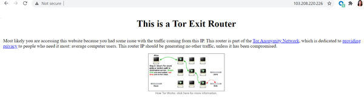
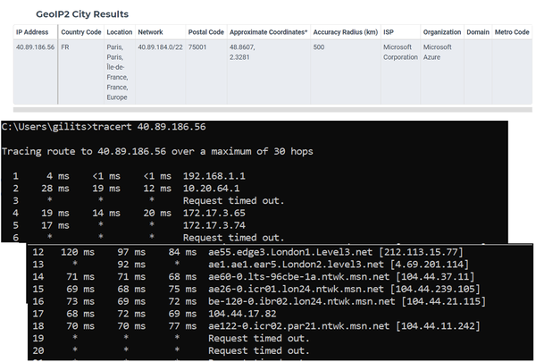
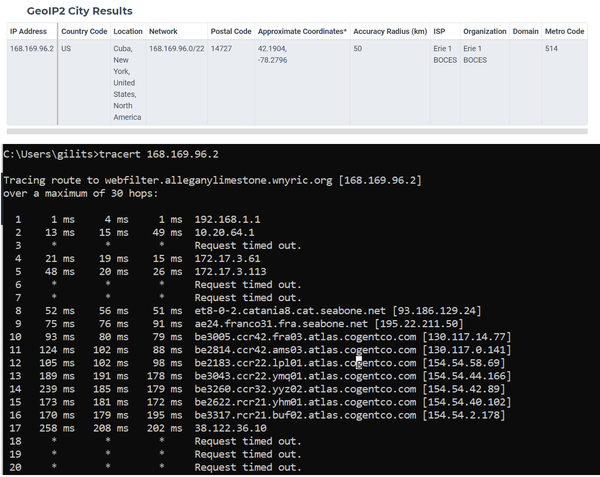
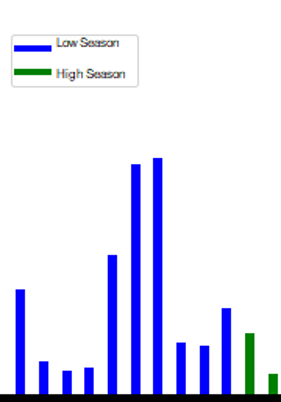

# 被盗信用卡诈骗

> 给早期发行版读者的注意事项
> 使用早期发布的电子书，你可以获得最早形式的书籍——作者在写作时的原始和未经编辑的内容——因此你可以在这些书名正式发布之前很久就利用这些技术。
> 这将是最后一本书的第 7 章。
> 如果你对我们如何改进本书中的内容和/或示例有任何意见，或者如果你发现本章中缺少材料，请通过 ccollins@oreily.com 与编辑联系。

我遇到的第一个欺诈受害者是我父亲。他是一个细心的人，定期检查他的银行对账单。有一天，他惊讶地发现自己显然一直在乌克兰购买商品，并在各种在线游戏商店收取费用。在最初的惊讶之后——他发现很难理解盗窃是怎么发生的，因为这张卡还在他的钱包里，当时他从未在网上使用过——我父亲被逗乐了。银行向他保证，他不会为任何此类活动买单，他很享受想象自己在基辅漫游的情景。
多年前我对欺诈的介绍并不罕见，Shoshana 也从她自己的家人和朋友那里讲述了类似的故事。被盗信用卡欺诈是普通消费者最有可能通过个人经历或朋友或家人的经历知道的欺诈形式。不幸的是，即使是像这种相当基本的攻击，不知何故，仍然会不时地被忽视。与受害者的购买习惯更密切匹配的攻击也属于此类欺诈，并且更难以阻止。在这两种情况下，消费者可能需要一段时间才能注意到问题所在，要么是因为银行对账单不明确，要么是因为时间过长以至于消费者在浏览时错过了最初的几次盗窃事件。这种延迟增加了挑战，因为在客户注意到问题并启动退款流程之前，欺诈预防团队不会通过退款收到欺诈交易的警报。

> 警告
> 确实，使用此 MO 的欺诈者倾向于采用“完成胜于完美”的方法。这会让公司产生一种错误的安全感，假设他们能够轻松阻止此类攻击。这本身就是一种风险。
> 我们应该对这种流行的攻击形式保持警惕，记住我们的系统有时即使是最简单的攻击类型也容易受到攻击，欺诈不一定要优雅才能有效。有许多盲点削弱了零售商和银行的反欺诈能力。

> SILOS 支持被盗信用卡欺诈
> 在我们深入研究被盗信用卡 MO 以及 IP 分析如何帮助打击它之前，先谈谈这个话题。打击被盗信用卡欺诈的部分挑战不是来自欺诈者，而是来自我们自己系统的弱点。欺诈团队目前被迫各自为战，相互隐瞒关键信息。一方面，零售商无法访问用户的信用卡历史记录，因此必须尽其所能利用他们可用的有关用户或以前交易的信息。另一方面，银行对客户的历史记录有细致的了解，但缺乏对每个特定订单的购买项目或制作人的个人资料的完整解决方案。 （信用卡网络和其他类似的参与者很少看到数据，通常甚至看不到所涉及的持卡人的姓名，因此出于本书的目的，我们不会将它们包括在我们对欺诈预防工作的讨论中。）
> 隐私法规和市场演变的结合导致金融机构和电子商务零售商之间的合作不佳。 PSD2 和开放银行改革以及各种金融科技业务旨在改变这种状况。隐私增强技术的发展，使不同的组织能够在不共享数据的情况下利用彼此的数据，以及他们开始生成的无提供者选项，也提供了有趣的可能性。
> 时间会证明我们对被盗信用卡欺诈的防御是否真的变得更有弹性，而这些趋势对我们来说还太新生，无法在本书中涵盖。尽管如此，这些发展对于欺诈领导者保持警惕具有重要的战略意义。通过协作和更大的利用更广泛数据集的能力在可能的方面取得真正的进步，可能会对欺诈团队打击被盗信用卡欺诈的效率产生重大影响。

## 定义被盗信用卡欺诈

被盗信用卡欺诈通常是欺诈者的“门户 MO”，他们正在从物理盗窃和/或刷卡过渡。许多人仍然是业余爱好者，要么是因为缺乏能力，要么是对熟练所需的技术和知识缺乏投资。虽然他们通常在“暗网”论坛或频道上互相学习，但在相对开放（而非仅限邀请）的频道上共享的信息往往相当基本。这可能会导致欺诈团队将这种形式的欺诈视为本质上是业余的，但这将是一个错误；一些欺诈者成为该领域的主人，这使他们成为一个严重的威胁。
为了我们旨在识别和阻止此类欺诈的讨论的目的，我们将被盗信用卡欺诈定义为攻击者已经拥有受损凭据（信用卡号、到期日期、卡上的姓名、CVV）的检查点) 并且他们正试图购买商品或注册服务，以便通过这些被盗的详细信息获利。货币化通常可以通过转售所购买的商品来实现（无论是通过从货车后面出售运动鞋、交易加密货币、直销计划等）。出于本章的目的，我们将排除各种网络钓鱼/黑客行为，这些行为是获取被盗信用卡详细信息的必要第一步。我们还将排除在暗网上交易被盗信用卡信息的庞大生态系统，这些生态系统太大而无法详细介绍，而且与阻止这种形式的欺诈没有直接关系；当你试图识别和防止被盗信用卡欺诈时，重要的是欺诈者拥有这些详细信息并试图使用它们。他们如何获得信息是有趣的背景，但一旦他们到达你的网站，它不会帮助你阻止他们。
确实，被盗信用卡市场已经变得如此发达，以至于可以使用“欺诈端到端服务”（例如，欺诈者可以购买一捆被盗信用卡+匹配的 VPN + 匹配的老化/欺骗电子邮件）。但是，在这里我们将重点介绍欺诈者仅设法获得受害者的信用卡详细信息的情况。更复杂的“捆绑”场景将在银行部分中关于身份盗用和合成身份欺诈的章节中介绍。

## 作案手法

我们的情况：这个欺诈者正在查看电子商务零售商的网站，准备将他们想要的商品添加到购物车，并希望在不被零售商/付款处理方拒绝的情况下轻松浏览结帐和付款页面。
这是假冒 101。欺诈者希望通过成为信用卡的真正所有者，因此他们试图想出一切可以使他们与受害者相似的东西。
一个聪明的欺诈者会在他们登陆目标网站或应用程序之前很久就开始这个冒充过程，这使得他们更难被抓住。他们需要准备以下资源：

- 一个干净的设备，没有 cookie 将其与之前的攻击联系起来，也没有安装任何与欺诈相关的 sw/apps/plugins
- 与持卡人的个人资料相匹配的设备设置（例如，如果你是欧盟欺诈者，希望通过从日本被盗的信用卡获利，你需要模拟东京常用的移动设备）
- IP 提供商 + 地理位置以匹配受害者所谓的生活方式
- 为匹配受害者所谓的生活方式而量身定制的浏览和行为模式（包括时区、语言、浏览器历史记录、推荐 URL、浏览速度）

一旦准备好，骗子就可以去购物了，希望：

- 他们的目标零售商不会对受害者的购买历史造成太大的反常
- 受害者还没有该零售商的现有帐户
- 被盗信用卡尚未被该零售商系统上的其他欺诈者使用
- 欺诈者计划购买的商品数量/数量的速度不会对零售商产生任何影响
- 信用卡不会达到信用额度

聪明的欺诈者将在结帐页面上提供以下详细信息：

- 持卡人姓名和帐单/送货地址。这应该正确拼写和大小写，而不是复制/粘贴，并以合理的速度输入。 （在实物商品的情况下，关于送货地址的问题会变得棘手，我们将在稍后讨论的章节中讨论这个问题。）
- 联系电子邮件。有时，欺诈者会提供受害者的真实电子邮件，希望零售商不要尝试联系。然而，欺诈者通常需要或希望访问电子邮件，因此大多数欺诈者会寻找最近生成的电子邮件（或另一名受害者的欺骗性电子邮件），最好是具有与持卡人姓名相似的句柄名称的电子邮件。很少有欺诈者能够访问持卡人的真实电子邮件，尽管这可能是 ATO 类型攻击的一部分。
- 联系电话。欺诈者在这里放什么取决于所涉及的货物类型。某些服务需要访问相关电话和/或需要双因素身份验证 (2FA)。欺诈者可以绕过这一点，我们将在银行业章节中讨论这一点。在被盗信用卡 MO 中，更常见的是欺诈者提供与持卡人地理位置相匹配的虚假信息和/或 VOIP/一次性/公共电话号码。一些欺诈者还提供受害者的真实电话号码。无论哪种情况，他们都希望零售商不会尝试通过电话联系客户。
- 有时需要额外的 PII 信息（例如 ID 文档）。我们将在关于加密欺诈的章节中讨论这一点。

 最后，骗子点击“完成订单”按钮，并希望他们的赃物在路上。

### 鉴别
当然，有许多因素有助于识别被盗信用卡欺诈。我们将专注于 IP 欺诈识别，因为电子商务垂直是定义可疑 IP 行为的关键。正如本书第二部分的介绍中所解释的，我们将在接下来的章节中留下电子邮件/电话/地址/设备分析。我们还将把 IP 一致性（一个相关的问题）留给银行业章节，在那里它尤其相关。

> 笔记
> 本章假设你已了解有关 IP 连接类型的知识。如果你想了解有关此主题的更多信息，可以找到有关 IP 地址和 IP 标头、计算机网络如何工作、网络机器人和代理服务器、互联网核心协议、网络安全等的更多详细信息。

简而言之，通过 IP 掩码识别模仿是基于寻找以下一项或多项：

- IP 不匹配 - IP 连接与持卡人声称的位置/配置文件之间的地理位置/配置文件不匹配
- 重犯 IP - IP 与先前攻击有关的重要证据
- 非唯一 IP - 试图通过使用公共 IP 覆盖 IP 轨迹的重要证据
- 屏蔽 IP - 试图通过使用各种代理或 VPN 来掩盖 IP 轨迹的重要证据

我们现在将详细说明我们试图识别的每种类型的恶意 IP。

#### 不匹配的IP
分析不匹配基于识别 IP 注册的组织。例如。 IP 168.169.96.2 已注册到位于纽约的教育组织 (https://www.e1b.org/en/about-us/about-us.aspx)。如果我们在与该组织的预期活动不匹配的上下文中发现此 IP，我们应该怀疑它被用作代理。

> 警告
> 不幸的是，经常人手不足或以志愿者为主的非营利组织经常遭受网络安全卫生不良的困扰，这可能使它们成为欺诈者 IP 攻击库中的流行组件。这种技术具有心理方面的作用，因为欺诈分析师可能由于他们所做的出色工作而倾向于对非营利组织产生积极的感觉，因此不太怀疑或更可能对显然来自那里的行动产生怀疑的好处。欺诈团队应该防范这种自然但危险的偏见。

可以通过比较 IP 地理位置（可通过许多第三方工具和服务获得）来计算地理不匹配。我们不会讨论它是如何推导出来的，但重要的是要注意，虽然它可能很有用，但地理定位信息应该用一大勺盐来获取，原因如下：

- 绝对距离过于简单，不能作为欺诈指标。相当大的距离可以用一个地区的 IP 密度低来解释（例如，西伯利亚或美国农村的部分地区根本没有那么多 IP）。卫星连接也将显示远距离（例如沙特阿拉伯或海上连接）。
- 国家/城市的比较通常过于简单化。例如，人们经常在瑞士和意大利/德国/法国之间旅行。此外，虽然不太常见，但距离可能有历史/社会/经济原因；例如，如果服务提供商是法国人，则法属安的列斯群岛 IP 可能在巴黎注册。
- 受控组织 IP（公司、军队等）也会影响距离失配的简单分析。
- 最后但并非最不重要的是，有许多连接类型的地理位置反映了公司服务器而不是最终用户。使用亚马逊托管服务的公司可以为其所有员工显示单一的美国地理位置。移动连接类型也可以非常聚合，最多可以达到城市/州的分辨率。

如果你需要进一步说服为什么不应将纯 IP 地理定位视为完全可靠的位置指标，更不用说内疚或合法性，请阅读 (https://splinternews.com/how-an-internet-mapping-glitch-turned -a-random-kansas-f-1793856052）不幸的堪萨斯农场的故事被错误地与各种邪恶活动联系起来（并遭受了许多不愉快的后果）仅仅因为他们的 IP 靠近该国的中心，这是IP 地理定位识别服务 MaxMind 在没有准确 IP 的情况下使用的默认 IP 位置。
如前所述，如今避免误报和不必要的摩擦对于大多数欺诈团队来说与防止成功欺诈一样重要；欺诈预防的挑战和魅力在于在两者之间找到适当的平衡。过分依赖 IP 地理定位而不结合其他因素或考虑可能的细微差别，你将在阻止欺诈方面走得太远，并拒绝或挫败太多的好客户。

> 笔记
> 有趣的是，没有特定的地理位置附加到 IP。 IP 是分配给组织的多个八位字节，然后重新分配（然后重新分配...）。有关 IP 的所有其他数据都是统计数据，并且继承自在线完成的操作。然而，由于统计数据和从中得出的推论通常是可靠的，并且确实与地理有关，而且由于这是 IP 在打击欺诈中的主要用途之一，我们将松散地提及 IP 地理定位的想法，即使它是技术上不精确。

#### 屡犯者 IP

与地理定位距离一样，在没有额外犯罪证据的情况下，仅通过 IP 将重复犯罪者联系起来，不应被视为确凿的证据。 IP 通常以某种方式聚合，这意味着它们代表许多用户（ISP 可以回收家庭连接，移动 IP 聚合到蜂窝塔级别，nat 路由器将公司的许多员工转换为单个 IP，等等）
IP 信誉列表和数据库也是如此。例如，被列入垃圾邮件黑名单的IP在其他方面可能是完全干净的，从防止信用卡欺诈的角度来看肯定是安全的。

#### 非唯一 IP

这是欺诈者使用公共 wifi 网络来掩盖犯罪者身份的地方。它可能涉及（除其他外）接管邻居的开放 wifi，占用当地咖啡店的 wifi，或使用大学或高中的网络。
有时，这种使用非唯一 IP 进行混淆的方法似乎越来越不流行，但由于欺诈者的流行方式经常一波三折，我们保留这种方法不仅是为了完整性，还因为它可能再次成为一种技术未来几年的选择，特别是如果还开发了一些新的改进。
TOR：torproject.org 是欺诈者青睐的一种非唯一 IP 类型的示例。最初为隐私设计的 TOR 代理很快成为欺诈者的天堂，因此有时谷歌搜索带有“TOR”一词的 IP 字符串，或者在 IP 的反向 dns 上寻找正则表达式 TOR 是值得的。图 6-1 显示了一个 TOR 示例：103.208.220.226



图 6-1。这是你浏览到 103.208.220.226 时浏览器将显示的内容，该地址目前使用 TOR 代理。

#### 屏蔽IP

屏蔽 IP 更具挑战性 - 因此，研究起来更有趣！有许多托管和 VPN 服务可用于各种个人和企业用途。欺诈者使用所有这些，尽管一般来说业务联系通常更安全。首先要记住的是，并非每个代理/VPN/托管 IP 都一定是欺诈。这些技术有很多合法用途。再一次，过度依赖这个因素将导致高误报。它成为欺诈指标的可能性在一定程度上取决于零售商的类型和他们受众的技术水平（例如，游戏与服装）。
以下是使用跟踪路由检查的屏蔽 IP 的 2 个示例。 Traceroute 不能很好地扩展，并且有更多可扩展的方法来 ping IP，但是当你查看单个交易或用户时，它作为手动研究工具非常棒。在规模是一个问题的大多数情况下，团队通常会依赖 IP 映射供应商来完成这项工作，因此我们决定不将规模作为本节的主要因素：
IP 40.89.186.56 是法国 IP，注册为 Microsoft Azure 数据中心。运行跟踪路由检查（图 6-2）显示了使用 MSN 服务器从伦敦到巴黎的合理流程。对于这个IP的一个数据包来说，这是一个合理的流程，这表明即使该IP过去被用作代理，此时也可能不会被用于屏蔽来自另一台服务器的流量。我们可能会预测连接速度也应该没问题（尽管我们不会涉及受专利保护的连接速度测量）。



```sh
C:\Users\gilits>tracert 40.89.186.56
Tracing route to 40.89.186.56 over a maximum of 30 hops
  1     4 ms    <1 ms    <1 ms  192.168.1.1
  2    28 ms    19 ms    12 ms  10.20.64.1
  3     *        *        *     Request timed out.
  4    19 ms    14 ms    20 ms  172.17.3.65
  5    17 ms     *        *     172.17.3.74
  6     *        *        *     Request timed out.
  7    15 ms     *        *     ae3.bkp.pt.mx-mx.con.hotnet.net.il [213.57.0.245]
  8    14 ms    11 ms    15 ms  fr-c27157.kbm.org.il [212.179.1.157]
  9   137 ms    91 ms    88 ms  10.90.99.22
 10    74 ms    84 ms    73 ms  bzq-219-189-10.dsl.bezeqint.net [62.219.189.10]
 11    68 ms    70 ms    68 ms  bzq-179-72-242.cust.bezeqint.net [212.179.72.242]
 12   120 ms    97 ms    84 ms  ae55.edge3.London1.Level3.net [212.113.15.77]
 13     *       92 ms     *     ae1.ae1.ear5.London2.level3.net [4.69.201.114]
 14    71 ms    71 ms    68 ms  ae60-0.lts-96cbe-1a.ntwk.msn.net [104.44.37.11]
 15    69 ms    68 ms    75 ms  ae26-0.icr01.lon24.ntwk.msn.net [104.44.239.105]
 16    73 ms    69 ms    72 ms  be-120-0.ibr02.lon24.ntwk.msn.net [104.44.21.115]
 17    68 ms    72 ms    69 ms  104.44.17.82
 18    70 ms    70 ms    77 ms  ae122-0.icr02.par21.ntwk.msn.net [104.44.11.242]
 19     *        *        *     Request timed out.
 20     *        *        *     Request timed out.
```

IP 168.169.96.2 是来自教育组织（wnyric.org，在不匹配的 IP 部分提到过）的所谓纽约 IP。 Traceroute（图 6-3）显示了属于欧盟组织（Seabone.net，可能负责亚大西洋光纤）的法国服务器，然后数据包继续发送到 Cogentco 的全球服务器（可能在 APAC）。 看看合法的场景 - 托管服务提供商的服务水平很差。 查看欺诈场景 - 服务器用于从很远的地方中继恶意 http 请求。



```sh
C:\Users\gilits>tracert 168.169.96.2
Tracing route to webfilter.alleganylimestone.wnyric.org [168.169.96.2]
over a maximum of 30 hops:
  1     1 ms     4 ms     1 ms  192.168.1.1
  2    13 ms    15 ms    49 ms  10.20.64.1
  3     *        *        *     Request timed out.
  4    21 ms    19 ms    15 ms  172.17.3.61
  5    48 ms    20 ms    26 ms  172.17.3.113
  6     *        *        *     Request timed out.
  7     *        *        *     Request timed out.
  8    52 ms    56 ms    51 ms  et8-0-2.catania8.cat.seabone.net [93.186.129.24]
  9    75 ms    76 ms    91 ms  ae24.franco31.fra.seabone.net [195.22.211.50]
 10    93 ms    80 ms    79 ms  be3005.ccr42.fra03.atlas.cogentco.com [130.117.14.77]
 11   124 ms   102 ms    88 ms  be2814.ccr42.ams03.atlas.cogentco.com [130.117.0.141]
 12   105 ms   102 ms    98 ms  be2183.ccr22.lpl01.atlas.cogentco.com [154.54.58.69]
 13   189 ms   191 ms   178 ms  be3043.ccr22.ymq01.atlas.cogentco.com [154.54.44.166]
 14   239 ms   185 ms   179 ms  be3260.ccr32.yyz02.atlas.cogentco.com [154.54.42.89]
 15   173 ms   181 ms   172 ms  be2622.rcr21.yhm01.atlas.cogentco.com [154.54.40.102]
 16   170 ms   179 ms   195 ms  be3317.rcr21.buf02.atlas.cogentco.com [154.54.2.178]
 17   258 ms   208 ms   202 ms  38.122.36.10
 18     *        *        *     Request timed out.
 19     *        *        *     Request timed out.
 20     *        *        *     Request timed out.
 21     *        *        *     Request timed out.
 22     *        *        *     Request timed out.
 23     *        *        *     Request timed out.
 24     *        *        *     Request timed out.
```

查看这两个示例（图 6-2 和 6-3），你可以看到我们如何有效地跟踪数据包的地理和 IP 路由。这是一条路径，应该显示在故事背景下有意义的路线。如果它没有意义——如果它从一个国家疯狂地跳到另一个遥远的国家——那么这很可能表明主机位于其他地方，而你所看到的是混淆。例如，图 7-3 显示该位置并不是真正的纽约，而是在欧盟。至关重要的是，在这里以及几乎在所有情况下，你都需要记住这有一个很好的故事 - 即使是最好的用户也会发生不良连接 - 因此你需要进一步调查以了解其他数据点告诉你什么，并且建立对这是一个好故事还是一个欺诈故事的理解。

#### 警告：IP 分析的可靠性可能因地区而异

由于剖析 IP 数据对于正确的欺诈检测（包括被盗信用卡欺诈和几乎所有其他类型的欺诈）至关重要，几乎每个风险部门都求助于数字地图服务，该服务将 IP 转换为地理和 Whois/ASN 数据（自主系统编号，即注册数据）。你可以从这些服务中获得的信息对于帮助你了解有关用户的更多信息以及确定他们的故事是否合法是非常有价值的。然而，来自数字地图服务的数据并不是福音，重要的是要持保留态度。欺诈分析师有时会学会过分依赖它们，这可能导致本应避免的虚假下降。 （想想我们在上面不匹配的 IP 部分中引用的堪萨斯州的例子！）欺诈管理人员需要确保他们的团队理解这一点，以便他们可以适当地而不是盲目地使用这些有用的工具。
在本节中，我们将解释为什么你从这些服务中体验到的可靠性也可能取决于你的流量通常来自全球的市场。如果你的公司计划进入新市场，这也是需要牢记的，因为它可能会影响你的准确性（无论是积极的还是消极的），因此应该为进入新市场做准备。
为了澄清，让我们比平常更深入地了解该领域的主要参与者之一必须提供的服务。以下是 Maxmind 的 GeoIP2 服务阅读器的一些有趣部分，Maxmind 是一种数字地图服务，是这些类型服务的一个很好的例子：
GeoIP2-python/database.py at master · maxmind/GeoIP2-python
在检查此类服务时，请记住以下几点：
支持的区域设置 - 区域设置代码可以暗示服务在全球范围内提供的覆盖水平。在这种情况下，默认为“en”并仅支持 7 个额外的语言环境表明 Maxmind 不一定能为几个新兴市场提供足够的覆盖。 Maxmind 承诺为英格兰德文郡（2019 年人口近 80 万）等地区提供令人印象深刻的解决方案，但它能否为孟买附近人口近 200 万的塔那市做出同样的承诺？在连接速度在确定连接类型方面发挥作用的情况下，我们能否期望对非洲的连接速度进行彻底测试？

| 国家的名字             | string       | 文件语言环境中此位置的国家/地区名称                          |
| ---------------------- | ------------ | ------------------------------------------------------------ |
| subdivision_1_iso_code | string (1-3) | 最多三个字符的字符串，包含与 IP 地址关联的第一级区域的 IS 3166-2 代码的区域部分。 一些国家有两个级别的细分，在这种情况下，这是最不具体的。 例如，在英国，这将是“英格兰”这样的国家，而不是“德文”这样的县。 |
| subdivision_1_name     | string       | 文件语言环境中此位置的细分名称。 与细分代码一样，这是位置最不具体的细分。 |
| subdivision_2_iso_code | string (1-3) | 最多三个字符的字符串，其中包含与 IP 地址关联的第二级区域的 ISO 3166-2 代码的区域部分。 对于有两级细分的国家，这将是最具体的——例如，在英国，像“德文”这样的县而不是像“英格兰”这样的国家。 |

MaxMind（以及业内大多数较大的供应商）同样支持 IPv4 和 IPv6。 然而，在撰写本文时，IPv6 仍然只是部分被业界采用。 随着印度和马来西亚等新兴市场成为 IPv6 采用率最高的国家之一，我们可能应该预期 IPv6 数据的地理精度水平较低。 像 Maxmind 这样的服务是否能够定制特定类型的参数，从而为 IPv6 带来更好的清晰度？ 如果可能，将 IPv6 转换为 IPv4 的字符串操作怎么样？
以下是Maxmind的Github上值得一看的相关部分：GeoIP2-python/database.py at master · maxmind/GeoIP2-python

```python
def __init__(
       self, fileish: str, locales: Optional[List[str]] = None, mode: int = MODE_AUTO
   ) -> None:
       """Create GeoIP2 Reader.
       :param locales: This is a list of locale codes. This argument will be passed on to record classes to use when their name properties are called. The default value is ['en'].The order of the locales is significant. When a record class has multiple names (country, city, etc.), its name property will return the name in the first locale that has one. Note that the only locale which is always present in the GeoIP2 data is "en". If you do not include this locale, the name property may end up returning None even when the record has an English name.
         Currently, the valid locale codes are:
         * de -- German
         * en -- English names may still include accented characters if that
          is the accepted spelling in English. In other words, English does
           not mean ASCII.
         * es -- Spanish
         * fr -- French
         * ja -- Japanese
         * pt-BR -- Brazilian Portuguese
         * ru -- Russian
         * zh-CN -- Simplified Chinese.
       """
       if locales is None:
           locales = ["en"]
       self._db_reader = maxminddb.open_database(fileish, mode)
       self._db_type = self._db_reader.metadata().database_type
       self._locales = locales
   def __enter__(self) -> "Reader":
       return self
   def __exit__(self, exc_type: None, exc_value: None, traceback: None) -> None:
       self.close()
       :returns: :py:class:`geoip2.models.ConnectionType` object
       """
       return cast(
           ConnectionType,
           self._flat_model_for(
               geoip2.models.ConnectionType, "GeoIP2-Connection-Type", ip_address
           ),
       )
   def domain(self, ip_address: IPAddress) -> Domain:
       """Get the Domain object for the IP address.
       :param ip_address: IPv4 or IPv6 address as a string.
       :returns: :py:class:`geoip2.models.Domain` object
       """
       return cast(
           Domain,
           self._flat_model_for(geoip2.models.Domain, "GeoIP2-Domain", ip_address),
       )
   def enterprise(self, ip_address: IPAddress) -> Enterprise:
       """Get the Enterprise object for the IP address.
       :param ip_address: IPv4 or IPv6 address as a string.
       :returns: :py:class:`geoip2.models.Enterprise` object
       """
       return cast(
           Enterprise,
           self._model_for(geoip2.models.Enterprise, "Enterprise", ip_address),
       )
   def isp(self, ip_address: IPAddress) -> ISP:
       """Get the ISP object for the IP address.
       :param ip_address: IPv4 or IPv6 address as a string.
       :returns: :py:class:`geoip2.models.ISP` object
       """
       return cast(
           ISP, self._flat_model_for(geoip2.models.ISP, "GeoIP2-ISP", ip_address)
       )
```

与许多事情一样，IP 准确性的一半战斗是知道你需要质疑它。使用此信息，你可以评估此类 IP 分析对于你所服务的不同全球市场的可靠程度，并且你可以在你的欺诈预防系统中对这些信息进行相应加权。

### 减轻

在探讨了识别有问题的 IP 地址的问题以及所涉及的限制之后，我们现在将重点讨论如何缓解该问题。关于 IP，我们这里的工作假设是，最终目标应该是设计一个自动化系统，以拒绝来自已被检测到由攻击者操作的 IP 的付款。我们已经确定，盲目依赖外部数字地图服务是行不通的。因此，我们必须学习如何在我们希望抓住的欺诈者所展示的独特作案手法的背景下利用来自外部供应商的数据。
请注意，在人工审核期间，同样的考虑也会发挥作用，并且可以如此使用，但至少最好有一个合理的自动评分系统，为人工审核人员提供用于 IP 的分数，而不是必须每次都测量每个元素，这将非常耗时。当然，在需要深入研究的情况下，为了改进系统的采样和分析，深入细节也是必要的。但这不是日常使用的标准。
在你的欺诈系统中使用 IP 位置时，需要牢记以下重要注意事项：

- 你需要快速恢复此数据点，并尽可能实时恢复。即使你自己有大量的计算能力可以使用，你几乎肯定仍会依赖外部地理定位 IP 数据源，这些数据源有自己的 SLA。打电话给他们需要时间和金钱。你可以通过利用基于拒绝名单的检查点和/或从数据源批量下载来缓解此问题，而不是实时调用。
- 不要自满。数据源应该经常受到挑战和刷新。手动采样将向你展示简单的正则表达式查找可以教你很多东西（例如，查找在名称中带有“hotel”的组织名称下注册的 IP）。
- 如果可能，查询多个服务以获取 Whois/ASN 数据。相互交叉引用不同的服务，加上反向 DNS（值得学习 gethostbyaddr 功能，例如在 O'reilly 出版的 Kerry Cox 和 Christopher Gerg 出版的书“Managing Security with Snort and IDS Tools”中，可在此处获得：DNS/Reverse DNS 查找）

```python
import socket
 
ipAddress = "8.8.8.8"
hostName = socket.gethostbyaddr(ipAddress)
print("Host Name for the IP address {} is {}".format(ipAddress, hostName))
Output:
Host Name for the IP address 8.8.8.8 is ('dns.google', ['8.8.8.8.in-addr.arpa'], ['8.8.8.8'])
```

- 累积指标（例如，此 IP 在我的系统上记录的频率）可以帮助你避免误报，但当然，除非你在财团中工作或使用财团工具，否则你会错过其他商家认识的欺诈者。
- 在你自己的系统中探索其他有趣的指标，看看它们是否可以提高检测不良 IP 的准确性，这是一个好主意。你可以考虑国家/语言故障、操作系统故障、设备数量、周末/夜间活动等指标。有些可能对你的公司有价值，有些则可能没有 - 这在不同的企业之间存在很大差异，即使在同一行业内也是如此。无论如何，请记住，只有当你有足够的数据时，它们才能可靠地工作；在你投入时间进行分析之前，请检查这一点！数据不足导致结果不可靠。

概述了在使用 IP 地址进行欺诈分析时需要牢记的一般注意事项后，我们现在将看几个示例，以更具体的形式给出这些解释。

#### 示例 1：使用 IP 地理定位来识别合法的酒店 IP

出于本示例的目的，我们假设我们是一家旅游零售商，专注于销售机票。我们的目的是识别通过酒店 wifi/固定电话连接浏览的买家所下的订单。此目的背后的基本原理是，酒店 IP 往往会导致误报，仅仅是因为它们的地理位置与游客帐单地址所在的国家/地区不匹配，我们希望避免这些误报。我们将使用以下（非常简单的）数据库表，称为 ORDERS，其中包含以下数据点来识别潜在的欺诈 IP：

| ORDERS.orderID | ORDERS.Order date | ORDERS.IP | ORDERS.IP country (from 3rd party vendor) | Whois query result: ORDERS.Hostname (from 3rd party vendor etc.) | Billing Address Country |
| -------------- | ----------------- | --------- | ----------------------------------------- | ------------------------------------------------------------ | ----------------------- |
| 1111           | January 1         | 1.1.1.1   | Slovakia                                  | Metronet.sk                                                  | US                      |
| 1122           | January 1         | 2.2.2.2   | US                                        | Hilton.com                                                   | US                      |
| 2233           | January 2         | 3.3.3.3   | Ireland                                   | Hilton.com                                                   | US                      |
| 3333           | January 4         | 1.1.1.1   | Slovakia                                  | Metronet.sk                                                  | France                  |
| 5555           | January 30        | 1.1.1.1   | Slovakia                                  | Metronet.sk                                                  | Germany                 |
| 6666           | January 30        | 4.4.4.4   | Slovakia                                  | Metronet.sk                                                  | Slovakia                |

以下简单查询将返回应被我们的欺诈检测系统视为酒店的 IP：
首先，我们将获取域名明确表明其为知名酒店所有的IP列表

```sql
WITH hotel_IP_based_on_domain AS
(
	SELECT orders.IP
	FROM orders 
	WHERE orders.Hostname like ‘%Hilton%’
	GROUP BY 1 
)
```

其次，我们将获取显示每月来自 2 个以上国家的买家的 IP 列表

```sql
WITH hotel_IP_based_on_billing_country_distribution AS
(
	SELECT orders.IP, 
		MONTH (orders.order_date) AS MONTH,
		COUNT(DISTINCT orders.billing_country)
	FROM orders 
	GROUP BY 1,2 
	HAVING COUNT(DISTINCT orders.billing_country)>2
)
```

我们将使用 union-all 来统一列表以删除重复项

```sql
SELECT IP FROM hotel_IP_based_on_domain
UNION ALL 
SELECT IP FROM hotel_IP_based_on_billing_country_distribution;
```

此查询返回以下结果，我们将在下面详细讨论。

| IP      |
| ------- |
| 1.1.1.1 |
| 2.2.2.2 |
| 3.3.3.3 |

由于其 Hilton 主机名，IP 1.1.1.1 和 2.2.2.2 均已返回。
返回 IP 3.3.3.3 是因为它显示了来自 3 个计费国家/地区的用户访问，根据我们的逻辑，这些国家/地区表示酒店。有人可能会注意到 Metronet 不是与旅游业相关的主机名，甚至也不是与业务联系相关的主机名。它是斯洛伐克的热门 ISP，因此数据背后的“酒店”很可能实际上是一家小型 B&B/沙发冲浪机构。或者，它甚至可能是一个移动蜂窝塔，恰好位于许多游客下订单的区域（例如机场）。
IP 4.4.4.4 没有返回，因为它只显示来自斯洛伐克的订单。 IP 4.4.4.4 注册到 Metronet 的事实，就像 IP 3.3.3.3，如果我们希望达到另一种酒店检测启发式，可以使用基于每个主机名的国家/地区分布的启发式方法。例如。：

```sql
WITH hotel_IP_based_on_billing_country_distribution AS
(
	SELECT SELECT TOP(10) PERCENT Hostname FROM --top 10% most likely hotel IPs
(SELECT 
 		orders.Hostname, 
		MONTH (orders.order_date) AS MONTH,		
(Case when orders.billing_country<>orders.IPcountry then 1 else 0 end) --crossborder orders
/count(orders.OrderID)*100 AS percentage_of_crossborder                 --divided by all orders
	FROM orders 
	GROUP BY 1,2 
ORDER BY percentage_of_crossborder DESC      
));
```

显然，我们可以在这个简单的示例上构建许多很酷的技巧和有趣的考虑，我将在这里推荐一些来改进主机名方法和国家/地区分配方法。
关于主机名方法，你需要考虑需要维护。例如，如果你使用域名的方法，你需要定期更新酒店列表，因为这是一个相当动态的列表。你也可能会遇到繁重查询的麻烦，因为使用“LIKE”子句可能很快就会变得太繁重。出于这个原因，使用更通用的术语可能更可取。例如寻找各种语言的正则表达式“hotel”，如果有的话，它应该会显示在 OrgName 字段中。重要的是，主机名方法有点容易误报。为了平衡这一点，你可以使用“计费国家/地区分配”的方法作为预防措施。例如，如果域名“hilton.com”出现在 IP 爱尔兰，而没有任何重要的非爱尔兰计费国家/地区 - 也许这不是酒店的真正 IP。
关于国家分布方法，请记住分布启发法需要统计知识。这可能有问题，也可能没有问题，具体取决于你的用例——虽然这里描述的简单示例可以很好地适用于个别电子商务零售商，但它们不够准确，无法应对大数据挑战（例如支付巨头通常遇到的挑战） ）。在这些情况下，人们可能会考虑使用更精细的方法来计算分布分数，例如计算方差分数。
还要记住，分布启发式需要阈值调整。选择每个 IP 每月两个计费国家的任意阈值显然是幼稚的；人们很容易想到非酒店场景，这可以解释为什么来自 2-3 个不同国家的访客会从一个 IP 出现（例如，国际公司的办公室，来自不同国家的员工经常访问）。使用百分位数代替数字阈值在某种程度上会有所帮助。尽管如此，即使对于使用基于百分位数的阈值的团队，强烈建议重新考虑阈值，并牢记以下注意事项：
零售商的垂直行业（例如，旅游零售商希望在他们的数据中找到许多酒店 IP）
IP 国家 - 这是一个受欢迎的旅游目的地吗？
计费国家/地区 - 国家/地区细分是否符合我们对进入该国家/地区的旅游业细分的预期？
交易状态 - 我们能确定所有来自涉嫌检测到的酒店的订单都是合法的吗？也许他们中的一些人以欺诈退款告终，因此他们应该被排除在影响酒店检测的指标之外？
欺诈环的风险 - 来自某个 IP 的订单之间是否存在可疑的相似之处？也许这家所谓的酒店有特定的欺诈者？
IP 连接类型 - 一家受人尊敬的酒店是否有可能通过住宅宽带连接运营（在 domainName 字段中未显示酒店名称的连接？）
旅游趋势 - 这个季节/年度这个国家的游客多吗？例如，在仅在夏季获得大量国际旅游的国家/地区，你可能决定将酒店标识限制为仅在 7 月/8 月的流量。为此考虑以下 lambda 函数：

#### 示例 2：使用 IP 流量趋势识别欺诈假酒店 IP

虽然前面的例子侧重于通过识别合法的酒店 IP 来启用合法流量，但总会有涉嫌酒店 IP 的案例实际上是由欺诈者操作的。找到行为表明犯规的涉嫌酒店 IP 的一种相当奇特的方法是按月细分每个 IP 的年度登录活动。以下示例假设 7 月和 8 月是相关知识产权的旅游旺季：
ts_info['is_summer] = ts_info['time_of_year'].apply(lambda t: int(t.month() in [7, 8]))
（更多关于有用的 lambda 时间戳函数：掌握 Pandas 中的日期和时间戳（以及一般的 Python））
下面代码生成的图表显示，在旺季的 2 个月内，流量下降。显然，这个 IP 不应被视为我们风险系统中的酒店！在一年中最繁忙的时间里，酒店的交通不太可能急剧下降，因为酒店里的人比以往任何时候都多，并且使用 wifi 和 IP。 （对于这个例子，我们在这里假设非大流行情况。）



```python
import pandas as pd
import os
from matplotlib import pyplot as plt
from shap import force_plot
import numpy as np
%matplotlib inline
plt.rcParams["figure.figsize"] = [16, 7]

from matplotlib.patches import Patch
from matplotlib.lines import Line2D

ts_legend_elements = [Line2D([0], [0], color='b', lw=4, label=’tourism high season'), 
                      Line2D([0], [0], color='g', lw=4, label=’tourism high season')]
ts_info = pd.read_csv('ts_info.csv', index_col='ip')
ts_info['login_month'] = pd.to_datetime(ts_info['login_month'])
ts_info['is_high_season'] = ts_info['login_month'].apply(lambda t: int(t.month() in [7, 8]))
for ip in ts_info.ip:
   
        fig, ax = plt.subplots()
        plt.bar(ts_info.loc[ip]['login_month'], ts_info.loc[ip]['logins'], color=ts_info.loc[ip]['is_high_season'].map({0: 'blue', 1: 'green'}), width=0.05)
        ax.legend(handles=ts_legend_elements, loc='upper right')
        plt.title('logins per month and tourism season={}'.format(ip))
        plt.show()
    f, (ax1, ax2) = plt.subplots(1, 2, sharey=True)
    full_results_info.loc[ip][[col for col in full_results_info.columns if col.startswith('month_')]].plot(kind='bar', ax=ax1)
    ax1.set_title('logins per month')
    ax1.set_ylabel('mean normalized number of logins’)
    ax1.set_xlabel('month')
    full_results_info.loc[ip][[col for col in full_results_info.columns if col.startswith('tourism high_')]].plot(kind='bar', ax=ax2)
    ax2.set_title('logins per tourism high season')
    ax2.set_ylabel('mean normalized number of logins')
    ax2.set_xlabel('login_month')
    plt.show()
    shap_info.loc[ip].sort_values(ascending=False).plot(kind='barh')
    plt.title('SHAP values per feature extractedip={}'.format(ip))
    plt.show()
    shap = shap_info.loc[ip].sort_values(ascending=False)
    force_plot(0, shap.values, shap.index.to_list(), matplotlib=True)
```

这张图（由代码生成）表明我们这里所拥有的不太可能是一家正常运作的酒店。但是，至关重要的是，你需要记住这里还有一个很好的故事版本。它可能不是欺诈性的，只是因为它应该是酒店 IP 而几乎可以肯定不是。例如，它很容易成为连锁酒店的公司总部；这将是酒店名称的合法使用，也可以解释安静的夏季；公司员工正在休假。同样，它可以是为酒店 IT 部门维护的单独网络，其中许多人也会在夏天离开。所以你不想自动惩罚流量。这只是一个数据点。你需要更多信息来构建身份故事和正在发生的事情。
然而，即使它是一个好故事，你也不希望在你的系统中赋予它特殊的酒店地位。真正的酒店通常会获得特殊豁免，因为它们是一种不寻常的情况 - 酒店经常有来自世界各地的许多人入住。因此，他们将使用来自全球各地的信用卡、客户行为和设备，并且只会在那里停留很短的时间。这意味着在其他情况下可能是危险信号的许多因素，例如来自多个国家的使用相同 IP 的多张卡，不应该被酒店视为这种方式。这就是为什么准确确定所谓的酒店 IP 是否真的是一个如此重要的原因。

#### 示例 3：在变量设计中使用层次结构

在本节中，我们将从检查单个 IP 转向考虑多个输入。
为了扩展我们的酒店 IP 示例，我们可能会面临一个后续问题，即如果单个订单涉及多个 IP，该怎么办。例如，如果客户从爱尔兰的“希尔顿”IP 登录其帐户，则 3 天后从斯洛伐克的未知 IP 下订单。我们会说这个人很可能在旅行吗？或者他的帐户被黑了？
这里引入了使用层次结构的概念，我们可以使用 SQL CASE 子句来说明。该示例将演示如何将多个 IP 数据组合成关于帐户和/或用户的统一观察。
对于这个例子，我们再假设我们是一家旅游服务领域的电子商务零售商。我们希望识别可能是酒店常客的用户。为简单起见，我们将为数据库中的每个帐户仅使用 2 个 IP：
账号注册IP
上次登录账户的IP
以下是我们的 ACCOUNTS 表中的 IP 示例：

| ACCOUNTS.accountID | ACCOUNTS .IP_action | ACCOUNTS.IP | ACCOUNTS.IP_connection_type |
| ------------------ | ------------------- | ----------- | --------------------------- |
| 1111               | SignUp              | 1.1.1.1     | Hotel                       |
| 1111               | LastLogin           | 2.2.2.2     | Anonymous Proxy             |
| 2222               | SignUp              | 3.3.3.3     | Hotel                       |
| 2222               | LastLogin           | 1.1.1.1     | Hotel                       |

我们应该如何确定哪些用户是典型的旅行者？这取决于你是否怀疑 ATO（帐户接管）。 （有关 ATO 的深入研究，请参见第 14 章。现在，我们仅说明，尽管 ATO 是一种与盗卡欺诈不同的欺诈攻击方法，但有时在考虑后者时你需要牢记前者。）
如果你不怀疑 ATO - 你可以同时使用 LastLogin IP 和 SignUp IP 作为旅行者的指标。你的查询看起来有点像这样：

```sql
SELECT
ACCOUNTS.AccountID,
SUM(
	CASE WHEN ACCOUNTS.IP_connection_type = ‘Hotel’ THEN 0.5 ELSE 0 END) AS Hotel_IPs_rate
GROUP BY 1;
```

如果你确实怀疑 ATO，你宁愿忽略 LastLogin IP 并仅相信 SignUp IP 作为旅行者的指标。你的查询看起来有点像这样：

```sql
SELECT
ACCOUNTS.AccountID,
SUM(
	CASE WHEN ACCOUNTS.IP_connection_type = ‘Hotel’ AND 
ACCOUNTS.IP_action = ‘SignUp
 THEN 0.5 ELSE 0 END) AS Hotel_IPs_rate
FROM
ACCOUNTS 
GROUP BY 1;
```

由于这两个选项都不是完美的，你可能希望使用一个模型来考虑其他指标。 ATO 分析通常是适合机器学习模型的挑战。我们将在 ATO 章节中添加更多内容。

#### 在 IP 类型变量设计中使用层次结构

到目前为止，我们认为层次结构对于为你的用例选择最合适的 IP 类型很有用，当希望聚合多个登录到单个帐户的 IP 时。类似地，当面临关于单个知识产权的相互矛盾的证据时，等级的概念可用于选择最具指示性的知识产权类型。例如，当使用多个数字地图服务时（例如使用 Maxmind 和 IP2Location，或任何其他竞争对手），你必然会遇到矛盾的情况，（即一项服务声称某个 IP 属于酒店，而另一项服务声称声称该 IP 代表匿名代理）。
层次结构的实现应该基于你的用例。默认值通常应该是针对好的用户，这样积极的类别将战胜欺诈的类别。这里要强调的好因素是 IP 可能受到的监控方式，以及它们在地理上的精确定位的可靠性。例如，军事网络既受到严密监控，又可以在地理上精确定位。在这种情况下，建议的 IP 类别层次结构列表是：
从最受监控到最少受监控（即此 IP 的用户认为他们可以通过他们的连接进行跟踪）

1. 军事/企业/政府连接（监控网络）
2. 酒店/机场连接
3. 大学/教育机构连接
4. 宽带家庭连接
5. 宽带业务连接
6. 移动连接
7. 卫星连接
8. 当地机构/企业的公共无线网络
9. 安全/VPN 服务连接/小型企业
10. 数据中心/云/托管服务连接
11. 匿名代理连接

自然地，如果你的公司正在处理欺诈环，你可能会考虑颠倒这种层次结构，以尝试查找系统中的所有代理。另一种选择是根据具体程度对你的优先事项进行排序，即哪种类型的 IP 最能教会你有关使用它的人的身份的信息。以下是选择最佳 IP 类型以了解用户身份的层次结构示例 -

从揭示到匿名（即分析可以从他们的 IP 中获取有关该用户的情报）

1. 军事/企业/政府联系
2. 小企业IP
3. 宽带家庭连接
4. 大学/教育机构连接
5. 酒店/机场连接
6. 数据中心/云/托管服务连接
7. 当地机构/企业的公共无线网络
8. 托管服务连接
9. 卫星连接
10. 移动连接
11. 匿名代理连接

> 笔记
> 关于获取 IP 情报的其他方法，除了此处讨论的方法之外：显然，许多反欺诈组织和服务依赖于网络诊断启发式方法（开放端口扫描、延迟或数据包中继诊断等）。或者，一些移动 SDK（以及在更有限的程度上，网络 SDK）通过利用设备数据（例如 SSID/wifi 名称）来深入了解移动和 wifi 连接。可能值得问问自己，你的用例是否值得在你的 IP 上获得这种质量水平的数据的技术和/或法律努力。为了获得灵感，以下是该领域中一项古老而可靠的专利的示例，重点是检测中继通信：https://patents.google.com/patent/CA2552481A1/da

## 概括

在本章中，我们研究了被盗信用卡欺诈，这可能是最基本的“构建块”类型的欺诈 - 其他技术以此为基础，并且通常是新欺诈者在磨练犯罪技巧时使用的门户.我们还研究了 IP 识别和缓解，这在某种程度上具有类似的基础——一种分析形式，无论行业或你要防止的欺诈类型如何，都是必要的。当你将一项行动或交易的故事拼凑起来并确定它是欺诈故事还是合法故事时，详细的 IP 信息也非常有价值。这是你需要的关键能力之一，可与我们将在接下来的章节中讨论的分析结合使用，例如地址分析（我们将在下一章中介绍）、电子邮件分析、电话号码分析等。