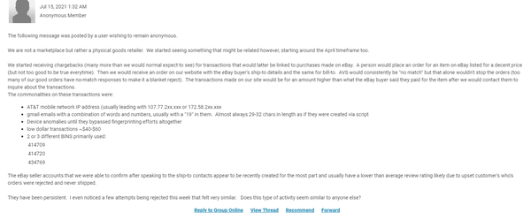
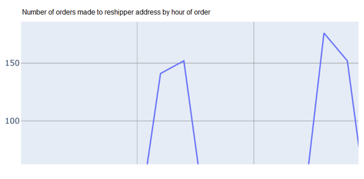

# 地址操作和骡子

> 给早期发行版读者的注意事项
> 使用早期发布的电子书，你可以获得最早形式的书籍——作者在写作时的原始和未经编辑的内容——因此你可以在这些书名正式发布之前很久就利用这些技术。
> 这将是最后一本书的第 8 章。
> 如果你对我们如何改进本书中的内容和/或示例有任何意见，或者如果你发现本章中缺少材料，请通过 ccollins@oreily.com 与编辑联系。

*“这里，那里，无处不在”*
如果你的工作包括保护经营有形运输物品的零售商，则本章适合你。如果你纯粹从事数字商品或金融服务，那么本章可能不太相关——但是，银行业的欺诈分析师请注意，其中一些技巧偶尔会被用来对付你的客户，针对新的信用卡或借记卡。从本质上讲，如果运送的是实物，欺诈者就会有兴趣将其作为目标。

## 这么多不同的偷窃方式

即使是最业余的欺诈者也知道处理送货地址是一项欺诈挑战。与 cookie、IP 操作、设备信息和其他更微妙的身份标志不同，物理地址是欺诈者在尝试下订单时会直视他们的一个问题。他们想偷一个或多个对象。这意味着他们需要亲自动手。他们有哪些选择？他们不能将其直接发送到他们自己的地址，但这太明显了，表明送货地址和账单地址没有联系并且存在欺诈行为，并且会将他们的真实地址交给可能尝试派执法人员去那里。通常，欺诈者与受害者住在不同的国家。问题归结为：欺诈者需要看起来像持卡人，或者至少像持卡人可能会将物品发送给的人（例如亲戚）。为了解决这个问题，欺诈者会进行地址操纵。也就是说，他们会想办法规避或欺骗地址挑战，隐藏地址不匹配。有许多不同的方法可以解决操纵问题，并且由于各种能力的欺诈者都参与其中，因此这些方法的复杂性和复杂性差异很大。
重要的是要记住，试图隐藏地址不匹配的行为并不一定会指向欺诈。一个好的消费者可能会在你的系统中意外触发危险信号的原因有很多：使用再发货人确保他们的家乡有可靠的送货公司，或使用变通办法来避税或降低送货成本，或发送各种物品一个将它们重新包装成品牌个人礼品包的人的活动，等等。这意味着揭露地址操纵不足以证明欺诈。这是一个有价值的信号，但与我们在本书中讨论的其他事情一样，必须在用户和交易故事的其余部分的背景下看待它。地址本身并无好坏之分。这是你需要担心的购买背后的身份。

> 笔记
> 大多数合法旅行者、外籍人士和其他人不会试图隐瞒送货地址和账单地址之间的差异。如果存在明显的、明显的地理不匹配——例如，帐单地址在洛杉矶，送货地址在 Timbuctoo——实际上很可能是合法的。尽管应该进行更多调查，但重要的是要确保你的系统不会自动将此类不匹配视为欺诈。如果是这样，你最终会得到很多误报。

### 包裹的物理拦截：门廊盗版

门廊盗版是欺诈者在持卡人的真实地址实际拦截包裹。当他们下订单时，他们将使用卡的帐单地址进行完美匹配，从而更有可能完成订单，但他们将使用自己的电话号码，因此他们将是最新的包的进度。相同的过程适用于帐户接管 (ATO)，网站显示帐户中的项目；欺诈者可以看到帐户的真正所有者何时下订单，并登录以查看其进度。在任何一种情况下，虽然听起来很可怕，但欺诈者可以直接潜伏在房子附近的灌木丛中，等待快递员带着货物到达。
门廊盗版比以前更常见，包括一些简单的盗窃案件，犯罪分子在附近地区寻找门廊上的包裹，然后带走。 （我们在这里不考虑这种形式的犯罪活动，因为大多数在线欺诈预防团队都不在研究范围内。）2020 年的一项研究发现，43% 的调查受访者的包裹被盗，其中 64% 的人表示他们不止一次成为包裹盗窃的受害者。 64% 的数字并不奇怪，因为当涉及相当高价值的物品时，欺诈者最有可能为门廊盗版而烦恼，而且一些家庭比其他家庭更有可能在网上订购更多的高价值物品。此外，在涉及 ATO 的地方，欺诈者多次罢工是很常见的。

### 包裹的物理拦截：说服快递员

门廊盗版的一种变体，不涉及潜伏在灌木丛中的可疑行为，说服快递员的方法是让欺诈者与快递员联系（通常是因为欺诈者使用他们的电话号码下订单）。
欺诈者会说服快递员稍微修改送货地址——例如，在街角与他们会合，因为他们已经出去了，正要回来。这是快递员在完全合法的情况下一直经历的事情，并且喜欢将其作为良好客户关系的一部分，使他们很难发现正常用例和欺诈用例之间的区别。

### 将包裹发送到方便的位置：欺诈开放日

使用这种方法，欺诈者的目标是使送货地址成为一个易于公开访问的地址，他们可以在那里闲逛等待包裹而不会显得可疑。开放式房屋出售非常受欢迎，街角商店、美发和美甲沙龙等小型企业或当地商场的商店也很受欢迎。在这些情况下，位置看起来是合法的，无论是在作为欺诈审查的一部分进行搜索时、在交易时，还是在快递员到达目的地时。
然而，有时会使用其他公共地址，尽管看起来不太合法，但由于访问方便，例如停车场甚至墓地。如果仔细选择，这些地址在被自动化系统或审查者审查时从远处看起来是合理的，当然可以反复使用，从欺诈者的角度简化了过程。即使快递员对地址有私人疑问，他们也可能会派送包裹，或者这种方法也可以与说服快递员方法结合使用，这样快递员永远不会到达停车场或墓地，而是在附近遇到.
这种方法确实需要欺诈者的研究，有时还需要与当地企业进行安排，也许正因如此，在高端商品被盗时最常使用这种方法。在这种情况下，这是一种非常流行的方法。

### 将包裹发送到方便的位置：Reshippers
跨境转运或货运代理服务在 2010 年代广受欢迎，一度成为欺诈者窃取实物的首选。很容易看出吸引力；对于实物运输问题，这似乎是一个如此简单的解决方案。过去，零售商从未看到购物者的最终地址。他们只能看到再运输公司本身的地址，这是零售商应该发送包裹的地方。因此，欺诈者可以使用转寄人来隐藏他们的真实位置并确保包裹到达他们手中。由于有大量合法消费者使用重新发货服务，这不是一个自动的欺诈标志，欺诈团队学会了谨慎但不要对这些服务过度偏执。
然而，如今的许多再运输服务都努力变得更加透明，如果不是最终目的地的客户身份，那么至少是交付国家和地区。这使得转货商对欺诈者的吸引力大大降低，因为这意味着大多数零售商将能够通过追踪诈骗所涉及的地址模式来识别重度滥用转货商的人。另一方面，有些人仍然采用这种方法，使用自己国家的一些方便的地址，使人们更难看到这些模式。鉴于在线犯罪生态系统已发展成为当前复杂的有组织犯罪集团系统（如引言和第 2 章所述），其中一些大型集团拥有许多可以在相关情况下使用的地址也就不足为奇了。此外，由于近年来转货商变得更加受人尊敬且与欺诈企图的关联性降低，欺诈团队不太容易怀疑，这有助于那些可以有效利用他们的欺诈组织。猫捉老鼠的游戏一如既往地继续。

### 远程拦截包裹：说服客户支持

欺诈者知道在交易时会检查订单是否存在欺诈，但他们也知道许多企业没有采取措施来防止流程后期的可疑活动。他们利用该漏洞来尝试解决运输挑战。他们最初会匹配帐单和送货地址，只有在订单获得批准后，他们才会致电客户支持并要求将地址更改为对欺诈者更方便的地址。他们通常对此很小心 - 它不会将地址更改为不同的国家/地区，甚至不同的城市，这很可能会为支持代表敲响警钟。相反，他们会在同一个城市或地区内做一些小的改变——也许使用前面在开放日方法中描述的地点之一。该请求对支持代表来说似乎是一个很小的变化——但从欺诈的角度来看，它已经足够重要了，如果该地址被包含在原始订单中而不是一个完美的地址匹配。

### 包的远程拦截：AVS 操作

可以在交易点之前和之后使用地址验证服务 (AVS) 操纵地址。在这两种情况下，欺诈者都会利用 AVS 系统只检查地址的数字而不是单词的事实。在结账时使用它的欺诈者将使用 AVS 操作来确保帐单地址的建筑物编号和邮政编码与送货地址的建筑物编号和邮政编码相匹配。这足以通过自动 AVS 检查，但对于任何关注订单的审阅者来说，这可能是一个危险信号。 AVS 匹配降低了进行审查的可能性。
更微妙的是欺诈者使用他们打算使用的地址的街道名称下订单时只匹配一个号码。然后他们打电话给客户支持要求一个小 - 这么小！ - 更改地址，只需更改建筑物和/或公寓号，但保持同一条街道。很难责怪支持代理被接纳。

### 骡子拦截包裹
欺诈者喜欢用骡子为他们做繁重的工作（这就是为什么他们被称为骡子）。骡子类似于 patsy 或猫爪，欺诈者雇用的人来执行重复性或仅要求他们住在特定地点的任务。对于运输骡子，欺诈者通常会做广告，让人们为他们接收和重新包装货物，然后将它们发送到欺诈者提供的任何地址。骡子是已经存在多年的黑暗经济的一部分，但随着越来越多的人失业并寻找可以在家完成的工作，骡子经济在大流行中大幅增长。绝望也可能让一些人愿意忽略这项工作可能不完全合法的迹象。这种情况现在开始被称为欺诈的零工经济。 （更多关于这一点，请参阅第 17 章关于市场攻击的内容。）骡子通常是有报酬的，至少有一段时间，尽管欺诈者有时会通过简单地消失来结束关系，让骡子当月没有报酬，并且可能自掏腰包支付他们的费用已经安排好了，希望得到报销。
欺诈者知道，当送货地址与帐单地址位于同一区域时，零售商更能容忍帐单/送货不匹配。许多合法客户将包裹寄给附近的朋友、家人和工作场所。此外，在客户搬家时更新账单地址可能需要很长时间，即使包裹到达持卡人手中也会导致不匹配。因此，如果欺诈者可以为所有连接到同一地理区域的多张卡购买被盗的卡信息，并且他们可以找到住在正确区域的骡子，他们就可以进行大量看似合法的欺诈性购买，将它们全部拥有送给骡子，然后让骡子把它们送到骗子方便的地方。由于大流行导致可用骡子的增加，欺诈者现在几乎可以轻松地在他们需要的任何地方找到骡子。通常，他们会在地址中将持卡人的姓氏添加到骡子的名字中，这样看起来就像是将购买的物品发送给家人。

> 笔记
> 骡子也可以用来支持大多数其他拦截方法——例如，骡子可以遇到快递员并从他们那里拿走包裹，或者从当地的商家那里取包裹。

### 更高级：向卡添加地址

这种方法更先进，需要欺诈者付出更多的努力，因此通常用于高价值商品，以使其值得所涉及的工作。在这里，欺诈者以信用卡发卡机构的客户支持代表为目标，并说服他们将他们（欺诈者的）自己的送货地址添加到存档的信用卡中。这样，就没有必要想出办法来解决缺少匹配的问题；将与文件中的地址匹配。
为了说服支持代理，欺诈者需要对持卡人进行大量研究，以便他们能够令人信服地回答有关他们的问题，并为新地址提供令人信服的理由。社交工程攻击是欺诈者最有可能获取此信息的方式，使用的诈骗方式包括爱情诈骗、鲶鱼、IT 技术支持诈骗等。这种方法还需要深入了解所涉及的发行人的流程，以便欺诈者会知道他们会被问到什么，以及要说些什么才能让人信服。所有这一切对于欺诈者来说都是完全可能的，但确实需要投入大量的时间和精力。出于这个原因，只有一小部分欺诈者使用这种方法，但那些这样做的人可能会因为他们的知识而非常危险。

### 更高级：向数据浓缩服务添加地址

这是一种类似于向信用卡添加地址的攻击方法。在这里，欺诈者的目标是在网上建立一个令人信服的图片，将持卡人与欺诈者的地址联系起来。为此，他们将针对数据丰富服务，让这些服务的客户支持代表将他们自己的地址添加到他们为持卡人存档的信息中。就像给卡片添加地址的方法一样，这需要时间，并且需要了解数据丰富服务的流程，因此，与该方法一样，通常在针对值得投资的高价值项目时使用此方法。

### 更高级：Dropshipping Direct
在这种情况下，欺诈者实际上经营着自己的零售业务，并从另一个供应商处将货物直接发送给他们的客户。这与直销非常相似。然而，欺诈者不是经营合法业务，而是从他们自己的客户那里收取真实的付款（在此过程中获取他们的付款信息以备将来欺诈）并使用窃取的信息向商家下订单。当然，这种欺诈交易是使用欺诈者客户的送货地址进行的，因此看起来并不可疑。欺诈者通常会小心地将其与被盗的付款信息进行匹配，这些信息的帐单地址看起来非常接近。这比听起来容易，因为你记得他被盗的大部分信息将来自以前的客户，并且欺诈者使用合法企业可用的相同位置定位功能为其“业务”定位广告。这是一个欺诈骗局，实际上会在一段时间后自行运行。图 7-1 显示了一个企业意识到此类事件正在发生的示例



来自 MRC 欺诈斗士论坛的帖子

> 警告
> 与转货商一样，对于欺诈团队而言，仅识别代销商是不够的。 大量的代销商和大量的转货商都是为客户提供有用服务的合法企业。 欺诈分析师需要能够识别那些使用这种商业模式作为欺诈活动掩护的人。 作为交易审查的一部分，这不太可能是单个欺诈分析师会做的事情； 相反，这样的项目应该由团队同意作为优先事项，并给予自己的时间进行研究、结果分析和实施已确认的结果。

既然我们已经探索了一些最常见的操纵地址或将包裹重新路由到欺诈者所需目的地的方法，让我们来看看当这些攻击被用于你的业务时如何识别它们。 在本章中，我们将重点关注与地址欺骗相关的攻击类型。

## 识别和缓解
大多数欺诈部门使用许多标准识别方法，正如前面所讨论的，欺诈者擅长规避——特别是 AVS，或其他形式的账单-发货匹配。我们不在这里讨论这些，部分是因为它们是如此标准，部分是因为它们对于欺诈者和欺诈斗士来说都是众所周知的。同样，我们不会讨论系统中没有统一地址格式的漏洞，因此欺诈者可以通过添加点或破折号或类似符号来假装拥有新地址。对一致性的需求是众所周知的，从欺诈分析的角度来看并不复杂。如果你的系统缺少它，欺诈者就会利用它。 1
相反，本节着眼于在开放式房屋、骡子和再托运人的背景下识别运输操纵的其他方法。我们不会单独讨论直销或高级卡片/数据丰富技术，除非现在说如果你担心这些方法可能会被用来对付你，那么第 5 章中讨论的链接逻辑可能是最好的方法分析和缓解工作。
首先，我们将就物理拦截模型和客户支持技巧说几句。在这些情况下，欺诈团队在交易点识别问题（至少从地址的角度）确实没有很多事情可以做。在交易时，地址签出。这就是这些方法的重点。
你可以做的是确保跟踪后续步骤的系统（递送包裹的快递或送货服务，或接听电话的客户支持部门，或处理投诉和/或退款的部门）正在为你提供欺诈预防系统 跟踪故事展开所需的数据。你需要知道包裹何时在“目的地附近”而不是在给定的送货地址处被提取。你需要知道客户何时抱怨他们从未收到包裹。你需要知道客户支持代表更改了地址——或者，如果你已经提醒他们注意技巧并训练他们做出回应，则该代表被要求更改地址并被拒绝。你的系统需要所有这些信息，否则在拒付进入时它会包含错误的信息，你将从中吸取错误的教训。在门廊盗版的情况下，你甚至可能永远不会知道发生了欺诈。你需要能够在你的系统中跟踪这些欺诈方法，以便你可以确定它们给你的业务带来的问题有多严重，并采取相应的行动。你不能自己做到这一点。你需要与其他部门合作。
如果你还没有针对这种性质设置适当的地址跟踪，这听起来可能令人生畏，但只要你慢慢来并将其作为教育和欣赏的练习来处理，这通常很简单：你的工作是教你问题，以及他们对业务造成的损害，以及部门之间的协作如何对此产生重大影响。请记住，你要求的东西超出了他们的正常工作职责范围，因此请务必对他们的帮助表示感谢，并在这些数据帮助你使公司更安全时分享功劳。
这些类型的更改不随 SQL 或 Python 脚本一起提供，你可以插入以发挥魔力。然而，以这些方式改进公司的流程与找到合适的欺诈工具或深入研究一些好的分析研究同样重要。如果做得好，影响可能同样大。
### 打开房门
你的欺诈团队在开放日场景中的优势在于，就其性质而言，欺诈者可以多次重复使用同一地址。如果许多包发生这种情况，尤其是使用不同的名称，尤其是在相当短的时间内，那么这是一个危险信号，你的系统需要进行设置以识别这一点。这不是欺诈的明确迹象——例如，对于这种设置，有合法的储物柜或邮政信箱风格的安排——但这意味着你会想要你的系统，可能还有一个人类分析师，看看更多的。
由于这个弱点，欺诈者经常利用该位置攻击多个企业，确保每家公司只能看到几次该地址。如果你怀疑自己正在成为使用此模型的戒指的目标，那么探索与其他公司合作以帮助保护你的所有业务的可能性可能是值得的。

### 骡子
在地址操纵识别的背景下值得注意的是研究属于地址的质量的价值。如果你考虑一下，你的数据库中有很多关于普通合法人员通常如何在不同国家/地区键入地址的信息。如果你可以提取并利用该知识，那么你就可以查明该标准用法的异常情况。这些异常情况虽然不能提供绝对的欺诈确定性（它可能是一个合法的外国人使用非标准大写或缩短的城市），但很好地表明更多的调查可能是值得的。
以下假设查询语法对于检测系统地址中的异常是有效的：

```sql
With table_of_how_many_times_each_combination_of_zip_and_city_appeared
as 
(select zipcode, city, count(*) as count_orders
from shipping_addresses
group by 1,2)  
Select 
City, 
       PERCENT_RANK() OVER (PARTITION BY zipcode ORDER BY count_orders ) AS PctRank  
Order by PctRank asc;
```

此查询将生成最罕见的邮政编码和城市名称组合，前提是你的数据包含最终用户输入的城市（且未标准化）。你会看到一个看起来像这样的表：

| 运输地址_邮政编码 | Shipping_addresses_city（*由用户输入） | 计数（order_id） |
| ----------------- | -------------------------------------- | ---------------- |
| 10025             | New York                               | 13490            |
| 10025             | NYC                                    | 9832             |
| 10025             | newyork                                | 12               |
| 10025             | New York                               | 31               |
| 60198             | Telaviv                                | 2846             |
| 60198             | TLV                                    | 712              |
| 60198             | Telaviv                                | 4                |

例如，根据这个逻辑，你会发现大多数以色列人会写“Tel Aviv”或“Tel-Aviv”甚至“TLV”，但不会将“telaviv”写成一个词。因此，此查询将显示使用特拉维夫送货地址的非本地人。对于纽约，你可以看到“New York”和“NY”都是常用的，但“newyork”不是。非本地人可能值得研究——当然，除非他们将货物送到酒店，这可以被视为支持合法旅行故事的好兆头。看这个具体的例子，系统可能应该拒绝以“Telaviv”为单位的 4 个订单和以“newyork”为发货城市的 12 个订单。以“纽约”为运输城市的 31 个订单可能值得人工审核或额外的身份验证流程。
使用此查询，你将能够检测到非本地欺诈者试图输入其骡子的送货地址的情况。请记住，将有一些非本地人将货物运送到以色列/纽约地址的合法场景，但它们可能可以忽略不计 - 在这种情况下很少发生错误，因为通常朋友或家人会使用收件人提供的地址 - 这将包括标准用法。无论出于何种原因，欺诈者和他们的骡子都不是这样。也许，从心理上来说，骗子觉得他们已经把安排骡子和匹配卡和送货地址的所有辛苦工作都做了，所以他们在实际输入地址时会比较草率。
也就是说，你很可能会发现某些拼写错误的情况比其他情况更常见 - 例如，纽约比路易斯安那州拉斐特更有可能看到合法的品种，这仅仅是因为它作为运输目的地的受欢迎程度，所以你的模型应该或多或少相应地宽容。如果你有足够大的训练集，模型可以单独处理这些示例，但此处描述的常识搜索方法可以让你使用高级逻辑，即使你没有足够的数据/容量来训练模型。
你可以使用我们提供的前一个查询（我们鼓励你创造性地寻找类似查询）来区分即使是当地人也会犯的常见错误——在已经有两个或三个，例如 - 与不寻常的错误相比，这些错误表明可能值得进行更多调查。

### 转货人
与骡子不同，大多数企业确实希望允许再发货人——如前所述，它们有很多合法用途。另一方面，如果某些转销商反复与欺诈攻击相关联，你可能希望将其禁止或标记为“灰色”。
监控转货商通常是对过度用户进行持续监控的问题。如果幸运的话，再发货人地址将包含其背后特定客户的指标。例如，在下面的地址中，后缀 -CN6372 表示客户，也可能暗示目的地在中国：
95-CN6372 Mayhill St Unit H Saddle Brook, NJ 07663
但是，在很多情况下，送货地址并未指明最终用户。跟踪来自转货商地址的订单频率是明智的，以便能够发现特定转货商突然以可疑的方式获得动力。一个有用的 Pandas 数据框是 data_pivot_nunique。通过使用它（连同其更简单的变体 data_pivot_count），当重复用户使用再发货服务进行多次订单时，你将能够发现这两种情况，无论他们是否在所有订单中重复使用相同的电子邮件地址。

```python
data_pivot_nunique = data.pivot_table(index=['hour'], columns = 'reshipper', values = 'user-emails', aggfunc='nunique').reset_index()
```

在图 7-2 中，我们跟踪了一个欺诈者，他每天两次向再发货人发送多个订单。使用它，你可以看到每小时的订单数量如何从通常的基准（大约每小时 10-20 个）飙升至一天中 2 个特定小时的 150 个以上。



图 7-2。将数据绘制在图表上表明，一天两次，向一个特定转销商下达的订单数量出现异常激增。这应该表明 1（或 2）名欺诈者此时正在下订单。
下面是生成图表的代码：

```python
fig = px.line(
    data_pivot_count,
    x="hour",
    y="number of orders",
    title="Number of orders made to reshipper address by hour of order"
)
fig.show()
```

你可能想要搜索会鼓励并解释这些峰值的促销活动，或者订单之间可能存在合法联系（例如，企业一起协调活动）。像这样的异常结果本身并不是决定性的。但这是一个非常强烈的信号，绝对是需要进行更多调查的迹象。

> 笔记
> 在按小时衡量转货商的异常情况时，重要的是要调查他们所服务的市场。迎合澳大利亚、新西兰和新加坡的转货商在美国夜间显然会有更多的流量。找出每个转销商迎合的地区是
> 此处给出的示例绝不是识别和防止滥用重新发货的唯一方法。但是，这是说明你可以运行的有助于你的业务的各种分析的好方法。在这种情况下，与骡子一样，重要的是要考虑问题，探索不同的方法来识别地址及其使用的异常，而不是仅仅依赖工具或技术，如 AVS，虽然在一定程度上有用，但都是有限的欺诈者也知道，因此他们开发了绕过他们的方法。与往常一样，猫捉老鼠的游戏还在继续。为了取得成功，欺诈预防团队需要发挥创造力，并找到不同的方法来查看数据告诉他们的信息。

## 概括

在本章中，我们探讨了欺诈者应对计费/运输不匹配挑战的不同方式，以便他们使订单看起来令人信服，同时也从盗窃中受益。我们还研究了欺诈部门可以识别和减轻这些技巧的方法。在下一章中，我们将探讨另一种解决运输挑战的方法：利用点击提货。
1 感谢 Karisse Hendrick 指出一些组织尚未在自己的系统中统一地址格式，因此即使我们没有进一步讨论这个漏洞，即使在 2020 年代也值得一提。